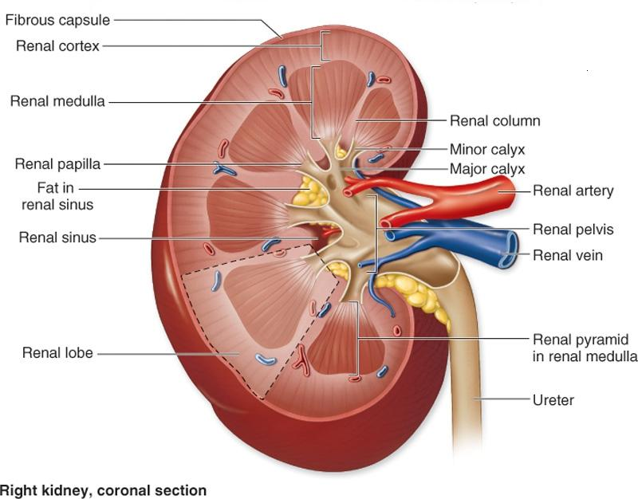
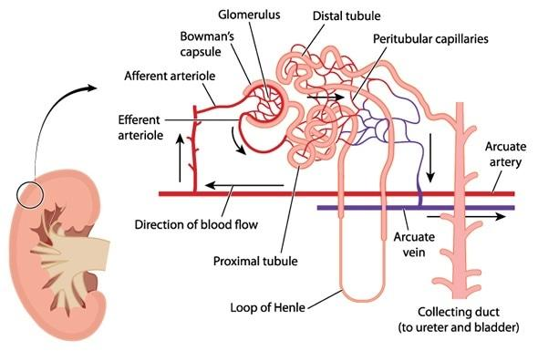

# 第八章 泌尿系统（Urinary System）

## 黑体词
waste products,Uremia,urine,kidneys,ureters,urinary bladder,urethra,nephrons,homeostasis,electrolytes,sodium,potassium,chloride,bicarbonate,pH,hilum,renal artery,renal vein,cortex,medulla,renal pyramids,renal papilla,calyx (pl. calyces),renal pelvis,renal corpuscle,renal tubule,glomerulus,glomerular,Bowman’s capsule,afferent arteriole,efferent arteriole,proximal convoluted tubule,loop of Henle,nephron loop,descending limb of the nephron loop,ascending limb of the nephron loop,distal convoluted tubule,collecting tubule,minor calyx,Filtration,glomerular filtrate,glucose,amino acids,toxins,Reabsorption,peritubular capillaries,Secretion,peristaltic waves,pubic symphysis,internal sphincter,external sphincter,stretch receptors,parasympathetic nervous system,meatus,vagina,prostate gland,semen,nitrogenous wastes,albumin

## 一、泌尿系统总览（Anatomy & Physiology）

* **核心功能**

  * 过滤并排出代谢废物，维持**水与电解质平衡**、**酸碱平衡（pH）**，维持**内环境稳态**（homeostasis）。
  * 废物滞留可致**尿毒症（uremia）**。

* **主要器官**

  * **肾（kidneys，成千上万的肾单位 nephron 为功能单位）**：调节体液容量、成分及pH。
  * **输尿管（ureters）**：将尿液由肾输送至膀胱。
  * **膀胱（urinary bladder）**：储尿囊。
  * **尿道（urethra）**：将尿液排出体外。

---

## 二、肾脏（Kidneys）

* **位置与外形**

  * **腹膜后位（retroperitoneal）**，脊柱两侧腰区；拳头大小，约 **4–6 oz**。
  * 外覆脂肪垫与纤维结缔组织保护。
  * **肾门（hilum）**：肾动脉入、肾静脉出、输尿管出。

* **宏观结构**

  * **皮质（cortex）**、**髓质（medulla）**。
  * 髓质内 **肾锥体（renal pyramids）**，锥体顶端为**肾乳头（renal papilla）** → 开口于**小肾盏（minor calyx）** → 汇入**大肾盏** → **肾盂（renal pelvis）** → **输尿管**。

* **体液调控要点**

  * **水分**：缺水时保水；过多时排出。
  * **电解质**：Na⁺、K⁺、Cl⁻、HCO₃⁻等的精细调节。
  * **酸碱**：维持适宜 pH，防止过酸/过碱。

> 图示：Fig.8.2 右肾,冠状切面

---

## 三、肾单位（Nephron）结构与血流

* **数量**：每肾约 **100万** 个。

* **两大组成**

  1. **肾小体（renal corpuscle）**：

     * **肾小球（glomerulus）**：毛细血管团。
     * **鲍曼囊/肾小囊（Bowman’s/glomerular capsule）**。
     * **入球小动脉（afferent arteriole）**入、**出球小动脉（efferent arteriole）**出。
  2. **肾小管（renal tubule）**：

     * **近曲小管（PCT）** → **亨利袢（loop of Henle/nephron loop）**：降支（descending limb）→ 升支（ascending limb） → **远曲小管（DCT）** → **集合小管（collecting tubule/duct）** → 肾乳头开口入小肾盏。

* **肾小管周围毛细血管**：**管周毛细血管（peritubular capillaries）**环绕小管，承担重吸收与分泌后的物质交换回循环。

> 图示：Fig.8.3 肾小管结构

---

## 四、尿的形成（Urine Formation）— 三大过程

> 发生于肾单位不同节段，终产物为尿（含废物、过量水/电解质）。

1. **滤过（Filtration）**：

   * 部位：**肾小体**。
   * 机制：肾小球血压推动水与溶质穿过滤过膜进入肾小囊，生成**肾小球滤过液（glomerular filtrate）**。
   * 成分：水、电解质、葡萄糖、氨基酸、代谢产物与毒素等（大分子蛋白与血细胞正常不通过）。

2. **重吸收（Reabsorption）**：

   * 部位：沿 PCT → 亨利袢 → DCT → 集合管全过程。
   * 内容：**大部分水**、大量**电解质与营养物质**被重吸收回**管周毛细血管**，重新回到血液。

3. **分泌（Secretion）**：

   * 部位：肾小管上皮细胞主动转运。
   * 内容：将**氨、尿酸及其他废物**直接分泌入小管腔，完善尿的成分。
   * 去向：集合管 → 肾乳头 → 小盏/大盏 → 肾盂 → 输尿管。

---

## 五、输尿管（Ureters）

* **解剖**：约 **25 cm**，自肾盂至膀胱，位于腹膜后、沿椎体旁行。
* **生理**：**蠕动（peristalsis）**推进尿液；频率与尿生成率相关（快则数秒/次，慢则数分/次）。

---

## 六、膀胱（Urinary Bladder）与排尿反射（Micturition）

* **结构**：

  * **平滑肌三层**（逼尿肌） + **黏膜皱襞（rugae）** → 可扩张储尿。
  * **功能**：暂时储尿。

* **排尿（Voiding/Micturition）反射**

  * **容量阈值**：约 **200 mL** 时，膀胱壁牵张感受器被激活，**副交感通路**诱发逼尿肌反射性收缩。
  * **括约肌**：

    * **内括约肌**：**平滑肌、不随意**，反射中松弛。
    * **外括约肌**：**骨骼肌、随意控制**，可有意识抑制/放松。
  * 若抑制排尿：反射暂止，继续储尿；再**200–300 mL** 后再触发新一轮反射。

---

## 七、尿道（Urethra）

* **开口**：尿道口（**urinary meatus**）。
* **女性**：长度约 **1.5 in**（~3.8 cm），位于阴道前方。
* **男性**：长度约 **8 in**（~20 cm），穿过**前列腺**至龟头顶端开口；兼具**排尿**与**射精通道**两功能。

---

## 八、尿液性质（Urine）

* **外观**：淡黄至清亮；**95% 为水**。
* **溶质**：电解质、毒素、含氮废物等；异常时可见**葡萄糖、血液、白蛋白**等。
* **日量**：约 **0.6–2.5 L/日**（受饮水、温湿度、情绪、呼吸频率、体温等影响）。
* **酸碱**：正常多偏**酸性**。
* **比重**：**1.001–1.030**。

---

## 九、常见诊断检查（Diagnostic Procedures）

* **BUN（Blood Urea Nitrogen）血尿素氮**：评估肾功能。肾功能衰竭时**尿素潴留↑** → **尿毒症（uremia）**风险。
* **膀胱镜（Cystoscopy）**：经尿道进入膀胱直视检查肿瘤、结石、炎症。
* **逆行肾盂造影（Retrograde pyelogram）**：经膀胱镜向输尿管/肾盂注入造影剂拍片，判断结石/梗阻。
* **尿培养与药敏（Urine C&S）**：检出致病菌并判定敏感抗生素。
* **尿常规（Urinalysis）**：物理/化学/镜检综合评估。

---

## 十、常见疾病（Pathology）

### 1) 肾结石（Nephrolithiasis）

* **成因/危险因素**：

  * **尿量减少/脱水**、运动致**失水**、**高尿酸血症**药物、**痛风史**；尿中**Ca²⁺、草酸盐、尿酸盐、磷酸盐**排泄↑。
* **症状**：

  * **肉眼/镜下血尿**；**突发、剧烈、间歇性绞痛**，从背部→腰胁→腹股沟放射；常伴恶心呕吐。
* **诊断**：血/尿检查、**腹部X线**等；尿化学有助于石成分判断。
* **治疗**：

  * **止痛+补液**；合并感染予**抗生素**。
  * 多数 **≤48 h 自行排出**；受**体型、前列腺增生、妊娠、结石大小**等影响。
  * **4 mm**：约 **80%** 可排；**5 mm**：约 **20%** 可排。
  * 不能排出 → **手术** 或 **体外/腔内碎石（lithotripsy）**。
  * 缓解后：**饮食与代谢管理**预防复发（依石成分调整）。

### 2) 肾盂肾炎（Pyelonephritis）

* **性质**：肾脏**严重细菌感染**，可急性或慢性。
* **病因途径**：

  * **血行播散**（少见）。
  * **上行感染（最常见）**：尿自尿道→膀胱→输尿管→肾；

    * **反流（reflux）**：膀胱输尿管返流（解剖瓣膜异常或梗阻/器械插入等）。
* **症状（急性）**：

  * **先发热** → 尿色改变 → **肋脊角压痛（flank tenderness）**；
  * 进展：疼痛、纳差、头痛、全身感染表现；
  * **儿童/老年**易出现高热惊厥、谵妄或非特异症状；
  * **刺激征**：尿频、尿急、尿痛。
* **诊断**：病史体检 + **血/尿常规、培养**，必要时**肾脏超声**。
* **治疗**：

  * **针对病原的抗生素**（经验用药后依据培养调整）；尿常在 **48–72 h** 转阴，但**疗程约 21 天**；
  * **重症/并发症**先住院；必要时**手术解除梗阻/矫治畸形**；
  * **停药数周后复培养**；**长期导尿者**需**长期随访**。

---

## 十一、阅读拓展：**终末期肾病（ESRD, End-Stage Renal Disease）**

* **定义**：肾功能不可逆、严重衰竭，**单纯药物无法维持生命**。
* **两大维持治疗**：

  1. **透析（Dialysis）**：人工替代血液过滤，存活依赖透析计划与体能状况。
  2. **肾移植（Kidney Transplantation）**：植入供肾替代功能；**非“完全治愈”**，需终身**免疫抑制**与随访。
* **移植关键**：**预防排斥（rejection）**

  * 常用免疫抑制：

    * **环孢素（Cyclosporine）**：抑制T细胞通信；不良反应与剂量相关（震颤、高血压、**肾毒性**等）。
    * **糖皮质激素（Corticosteroids）**：多副作用（骨质疏松、无菌性坏死、高血压/血糖、溃疡、满月脸等），多中心尽量**减量维持**或替代。
  * **严密随访**：定期**血/尿**，**超声**评估移植肾结构；必要时**血流学检查**确认供血。

---

## 十二、常用构词要点（Combining Forms / Suffixes）

### A. 结合形式（Combining Forms）

| 结合形式     | 含义        | 例词                           |
| ------------ | ----------- | ------------------------------ |
| albumin/o    | 白蛋白      | albuminuria 蛋白尿             |
| azot/o       | 含氮物      | azotemia 氮质血症              |
| cyst/o       | 膀胱        | cystitis 膀胱炎                |
| glomerul/o   | 肾小球      | glomerulonephritis 肾小球肾炎  |
| glycos/o     | 糖          | glycosuria 糖尿                |
| lith/o       | 结石        | lithotripsy 碎石术             |
| meat/o       | 尿道口/道口 | meatorrhaphy 道口缝合术        |
| nephr/o      | 肾          | nephromalacia 肾软化           |
| noct/i       | 夜间        | nocturia 夜尿                  |
| pyel/o       | 肾盂        | pyelogram 肾盂造影             |
| ren/o        | 肾          | renal transplant 肾移植        |
| ur/o, urin/o | 尿          | uremia 尿毒症；urinalysis 尿检 |
| ureter/o     | 输尿管      | ureterectasia 输尿管扩张       |
| urethr/o     | 尿道        | urethrostenosis 尿道狭窄       |
| vesic/o      | 膀胱        | vesicorectal 膀胱直肠的        |

### B. 常见后缀（Suffixes）

| 后缀    | 含义       | 例词                       |
| ------- | ---------- | -------------------------- |
| -lith   | 石、结石   | nephrolith 肾结石          |
| -ptosis | 下垂、脱垂 | nephroptosis 游走肾/肾下垂 |
| -tripsy | 砸碎/碎石  | lithotripsy 碎石术         |
| -uria   | 尿/排尿    | hematuria 血尿             |

---

## 十三、常见检查与术式名词速记

* **BUN**：血尿素氮↑ → 排泄障碍/尿毒症风险。
* **Cystoscopy**：膀胱镜直视下评估病变。
* **Retrograde Pyelogram**：逆行肾盂造影；查石与梗阻。
* **Urine C&S**：尿培养+药敏。
* **Lithotripsy**：碎石术（体外冲击波/超声/内镜）。
* **Nephrectomy**：肾切除；**Nephropexy**：肾固定术。
* **Pyelolithotomy/Pyelolithectomy**：肾盂取石术。
* **Cystostomy**：膀胱造口；**Ureterectomy**：输尿管切除。
* **IVP（Intravenous Pyelogram）**：静脉肾盂造影（文中作“intravenous pyelogram”）。

---

## 十四、重点英文单词（高频速记）

> 先给“考试高频+易混”清单（中文义简述）；需要更细的**词根/词缀三行法**记忆，我可再按你的清单逐个拆解。

* **homeostasis** 内环境稳态
* **uremia** 尿毒症
* **glomerulus** 肾小球 / **glomerulonephritis** 肾小球肾炎
* **Bowman’s (capsule)** 肾小囊/鲍曼囊
* **loop of Henle** 亨利袢
* **micturition** 排尿
* **peristaltic** 蠕动的
* **nocturia** 夜尿
* **hematuria / pyuria / glycosuria / albuminuria / anuria / dysuria**

  * 血尿/脓尿/糖尿/蛋白尿/无尿/排尿困难
* **hydronephrosis** 肾积水
* **nephrolithiasis / nephrolith** 肾结石
* **pyelonephritis** 肾盂肾炎
* **BUN (blood urea nitrogen)** 血尿素氮
* **cystoscopy / pyelogram / urinalysis / culture & sensitivity**

  * 膀胱镜/肾盂造影/尿常规/培养药敏
* **renal transplant / biopsy / nephropexy / cystostomy / ureterectomy**

## 十五、易考/易混点强化

* **滤过 vs 重吸收 vs 分泌**：部位不同、方向不同、目的不同。
* **括约肌控制**：内括约肌（平滑肌/不随意） vs 外括约肌（骨骼肌/随意）。
* **男女尿道差异**：女性短、易上行感染；男性长，兼性功能。
* **尿液指标**：比重 **1.001–1.030**；多偏酸。
* **肾结石排出概率与直径**：**4 mm ≈ 80%**，**5 mm ≈ 20%**。
* **肾盂肾炎抗生素疗程**：尿48–72 h 复常但**疗程约21天**。
* **BUN** 升高提示排泄障碍；需结合临床与其他肾功能指标评估。

---

## 十六、课后练习提示（与原文对应）

* **名词与结合形式/后缀**：对照“第十二节表格”即可快速作答。
* **判断与单选**：

  * 肾的功能**不包括**“把尿排出体外”（那是尿道的功能）。
  * 肾单位的血滤部位是**肾小体**；肾小管**近曲段**首段与囊相连；“滤过”依赖肾小球压力。
* **术式应用**：见“第十三节术式速记”。

> 需要的话，我可以把整套练习题**逐题解析**（含答案与“为什么”），便于强化记忆与考点回顾。

---

### ✅ 小结（一句话背诵）

**肾**以**肾小球滤过**启动，沿**小管重吸收+分泌**精修尿成分，经**集合管→肾盂→输尿管**入**膀胱**储存，达阈值触发**副交感排尿反射**，**外括约肌**随意控制；**BUN/尿检/膀胱镜/造影/培养**是评估利器，**结石与肾盂肾炎**是临床高频，**ESRD**依赖**透析或移植**与**免疫抑制**长期管理。

