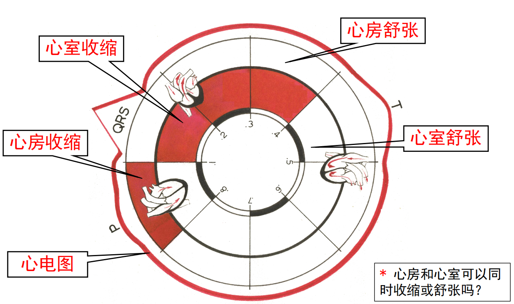
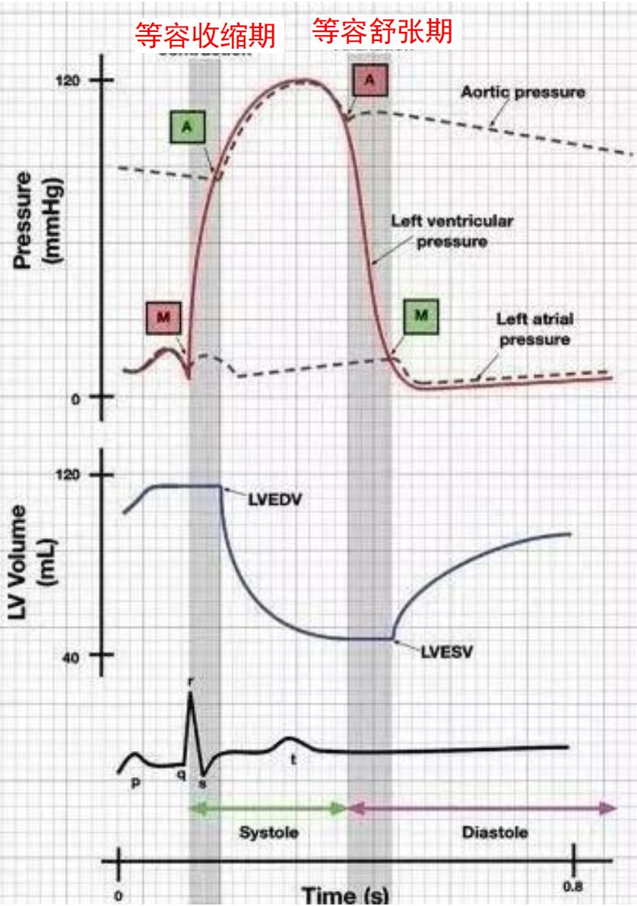

# 心脏的基本结构

---

## 一、全球与我国心脑血管疾病概况（流行病学提示）

* **全球负担**：每年约 **1700 万**人死于心脑血管疾病（CVD）。

  * 冠心病 *coronary heart disease*：约 **700 万**
  * 中风 *stroke*：约 **600 万**
* **中国现状**：约 **2.3 亿**人患病；每年死于该类疾病 **≥300 万**；**每 3 例死亡中有 1 例**与之相关；**每日约 8200 人**死于心脑血管病。

---

## 二、循环系统的组成与主要功能

### 2.1 组成

* **心血管系统 *Cardiovascular system***
* **淋巴系统 *Lymphatic system***

### 2.2 功能

* **循环功能**：心脏作为“血泵”推动血液在**封闭的血管系统**内**按一定方向周而复始**流动。
* **内分泌功能**：

  * 心脏分泌**心钠素 ANP（atrial natriuretic peptide）**
  * 血管内皮分泌**内皮素 endothelin**、**内皮舒张因子 EDRF/一氧化氮 NO**

---

## 三、血液循环的分途

* **体循环 *Systemic circulation***
  * **起点：左心室** → 主动脉 → 各级动脉 → **微循环**（与组织液/细胞进行**物质交换**：供 O₂、运 CO₂ 与代谢产物）→ 各级静脉 → **终点：右心房**。
  * 体循环中：**动脉多为含氧血**，**静脉多为含二氧化碳的血**。
* **肺循环 *Pulmonary circulation***
  * **起点：右心室** → 肺动脉 → 肺泡毛细血管（与肺泡进行**气体交换**）→ 肺静脉 → **终点：左心房**。
  * **肺动脉**内流的是**静脉血**，经肺交换后变为动脉血；**肺静脉**携带**动脉血**回左心房。

---

## 四、心脏的结构与基本解剖

### 4.1 心脏结构与细胞学

* 心脏是由约 **2×10⁹** 个**心肌细胞 *myocardium***构成的**肌性空腔器官**，通过**节律性收缩-舒张**推动血液循环。

### 4.2 四腔与收缩顺序

* 四腔：**左/右心房 *atria***、**左/右心室 *ventricles***。
* **心房与心室的顺序、交替收缩与舒张**是实现泵血功能的基础（与心电图事件对应）。

### 4.3 心脏瓣膜 *Cardiac valves*

* **房室瓣 *atrioventricular valves***：位于心房与心室之间，**左**二尖瓣 *mitral*、**右**三尖瓣 *tricuspid*
* **动脉瓣 *arterial valves***：位于心室与大动脉之间，主动脉瓣 *aortic*、肺动脉瓣 *pulmonary*
* **功能**：分隔腔室与动脉，是“**单向阀门**”，确保血流**单向**。

### 4.4 神经支配（植物/自主神经双重调控）

* **心交感神经 *cardiac sympathetic***：加速与增强
  * **交感神经**：起源于**脊髓胸 1–胸 5 段**（T1–T5），**兴奋性**作用为主（心率↑、收缩力↑等）
* **心迷走神经 *cardiac vagus***：减慢与减弱
  * **副交感（迷走）神经**：起源于**延髓**的迷走神经核，作用以**抑制性**为主（心率↓、传导↓等）

---

## 五、心动周期 *Cardiac cycle* 与机械事件

### 5.1 定义与心率

* 心脏每次**收缩+舒张**构成一个心动周期（包含**两心房**与**两心室**各自的**收缩+舒张**）。
* **心率 HR**：60–100 次/分；<60 **心动过缓 bradycardia**；>100 **心动过速 tachycardia**。
* 周期时长：**心动周期 = 1/HR**。例：HR=75 次/分 → 周期≈0.8 s。
* **最大心率公式**：约 **220 − 年龄**。

  * 青年约 **~200 次/分**。
  * **有氧心率**常取最大心率的**≈70%（约 60–80% 区间）**；如青年有氧运动心率**≈130 次/分**量级。

### 5.2 心动周期的时间分配

* **0.8 s 内的分配（以 75 次/分示例）**

  * **心房**：收缩 **0.1 s**，随后**舒张 0.7 s**。
  * **心室**：收缩 **0.3 s**，舒张 **0.5 s**。
  * **全心舒张期（全心舒血）**：**心室开始舒张后的前 0.4 s**，此时**心房与心室均为舒张**状态。
* **心率加快时的关键变化**

  * 周期**缩短**，**收缩期与舒张期均缩短**，但**舒张期缩短更明显**。
  * **利**：收缩期相对保持 → 有助于维持**射血量**与**灌注**。
  * **弊**：舒张期明显缩短 → **心室充盈时间减少** → 下个收缩期**射血量可能下降**。

> 图示：Fig.7.1 心房与心室的收缩活动顺序

## 5.3 血液单向流动的动力学要点（“直接动力”与“原动力”）

* **直接动力**：**压力差**。

  * **心房压 > 心室压** → 血由心房流入心室；
  * **心室压 > 动脉压** → 血由心室进入动脉；
  * 反向压力差会推动相应瓣膜**关闭**，防止逆流。
* **压力差的原动力**：**心室的收缩/舒张**引起心腔内压变化（心房亦有一定作用，但**心室为主**）。

### 5.4 心室收缩期（总 0.3 s）

1. **等容收缩期**（约 **0.05 s**）

   * 起因：心室开始收缩，**心室压 > 心房压**（房室瓣关闭），但**仍 < 动脉压**（动脉瓣亦关闭）。
   * **两瓣皆闭** → **心室容积不变**（“等容”）。
   * **心室压快速上升**，为后续射血“蓄压”。
2. **射血期**（总约 **0.25 s**，含两相）

   * **当心室压超过动脉压，动脉瓣开放** → 血液射入动脉。
   * **快速射血期**（~**0.10 s**）：压差大，射血速度快。
   * **减慢射血期**（~**0.15 s**）：随心肌收缩力渐减且动脉内血量增加、动脉压升高，射血速度减慢。

### 5.5 心室舒张期（总 0.5 s）

1. **等容舒张期**（约 **0.06–0.08 s**）

   * 心室收缩终止、**动脉压回落**，**当动脉压 > 心室压**时，**动脉瓣关闭**。
   * 此时**心室压仍 > 心房压**，**房室瓣关闭**。
   * **两瓣皆闭** → **心室容积仍不变**（“等容”），但**心室压快速下降**。
2. **充盈期**（约 **0.42–0.44 s**）

   * **当心室压 < 心房压**，**房室瓣开放** → 血液由心房（与静脉回流连续）进入心室。
   * **快速充盈期**（约 **0.10 s**）：房室压差大，血快速涌入。
   * **减慢充盈期**（约 **0.20 s**）：压差缩小，流入速度下降。
   * **心房收缩期**（约 **0.10 s**）：心房收缩进一步“挤压”血液入室。
   * **充盈量的主力阶段**：**快速充盈 + 减慢充盈**两相之和**占总充盈量的 >70%**；心房收缩贡献 **<30%** 。
   * **全心舒张期**对应：心室开始舒张后前 **0.4 s** 内，**心房、心室均舒张**。

> **两条重要认识**
>
> * **心室并非“一收缩就射血”**：必须**心室压超过动脉压**后才开始射血（此前为等容收缩）。
> * **心室也并非“一舒张就充盈”**：须**心室压先降至低于心房压**，房室瓣开放后才发生充盈（此前为等容舒张）。
> * **充盈的直接动力**仍是**房室压差**，其**主要成因**是**心室舒张致室内压下降**；心房收缩仅是**次要促进因素**。
> * **一次射血量仅为充盈量的约 55%**（对应 **射血分数 EF 55–65%**）
---

## 六、压力/容积变化图

> 图示：Fig.7.2 心室压力-容积变化图

* **M→A 段（收缩早期）**：**心室压上升最快**，但**两瓣关闭**，对应**等容收缩期**，**心室容积不变**。
* **当心室压 > 动脉压**：进入**射血期**，**心室容积快速下降**（先快后慢）。
* **A→M 段（舒张早期）**：动脉瓣关闭，**等容舒张期**，**心室容积不变**，**心室压快速下降**。
* **快速充盈期**：**心室压最低点**多出现在此相；其后因血液不断灌入，**心室压缓慢回升**。
* **常见考法举例**（按口述提示）

  * “一个心动周期中心室内压**变化速率最快**的时期”：**等容收缩期**（亦可问及等容舒张期的快速下降）。
  * “心室内压**最高**多见于”：**快速射血期**附近。
  * “心室内压**最低**多见于”：**快速充盈期**附近。
---

## 七、心输出量与相关指标

### 7.1 基本量

* **每搏输出量 SV（stroke volume）**：**一侧心室每次收缩射出的血量**。

  * 正常约 **60–80 mL/搏**，课堂口述取**平均 70 mL/搏**。
* **心输出量 CO（cardiac output, 每分输出量）**：**一侧心室每分钟射出的血量**。

  * 计算：**CO = SV × HR ≈ 5 L/min**（静息成人）。

### 7.2 射血分数 **EF**

* 定义：**EF = SV/EDV × 100% = (EDV − ESV)/EDV × 100%**
* 正常约 **55–65%**
* **考点**：若 **SV 变化不大而 EF 明显下降** → 多提示 **EDV 增大**（如扩张性心肌病/容量负荷增加，分母变大致 EF 下降）。

### 7.3 心指数 **CI**

* **CI = CO / 体表面积（m²） ≈ 3–3.5 L/(min·m²)**
* 与机体代谢需求密切相关（随年龄/体表面积而校正）。

### 7.4 心泵功能储备 **Cardiac reserve**

* **CO 最大可增至 ~25–30 L/min**（运动/应激）
* **储备来源**：

  * **搏出量储备**：**收缩期储备（ESV↓）+ 舒张期储备（EDV↑）**
  * **心率储备**
* 典型对比（示意）：

  * **静息**：CO≈5 L/min，HR≈75/min，EDV≈125 mL，ESV≈55 mL，SV≈70 mL
  * **剧烈运动**：CO≈30 L/min，HR≈180/min，EDV≈140 mL，ESV <20 mL，SV >120 mL

---

## 八、心泵功能调节总论（四要素）

> 目标：通过改变**收缩程度**与**心率**调节 CO

* **前负荷 preload**（**EDV/EDP**，即收缩前的负荷；反映**初长度 initial length**）
* **后负荷 afterload**（收缩时对抗的负荷；**动脉血压**）
* **心肌收缩能力 contractility**（与负荷无关的**内在收缩强度/速度**，等长自身调节）
* **心率 HR**

---

## 九、前负荷（Frank–Starling 机制）

### 9.1 定义与心室功能曲线

* **前负荷 = 心室舒张末期容积/压力（EDV/EDP）**
* **Starling 定律**：在一定范围内，**EDV/EDP↑ → 初长度↑ → 收缩力↑ → SV/搏功↑**（**异长调节 heterometric autoregulation**）
* **最适充盈压范围**：一般充盈压约 **5–6 mmHg**；**12–15 mmHg** 为较适宜范围；**15–20 mmHg** 左右曲线趋于**平台**，**不出现明显下降支**。

### 9.2 为什么心功能曲线**不出现下降支**（与骨骼肌差异）

* **心肌外间质**有较多**胶原纤维**，限制过度延展
* **多层心肌纤维走向不同**，宏观力学呈**“安全网”**
* **肌节连接蛋白（如 titin/连接蛋白）**提供弹性限幅

### 9.3 影响前负荷的因素

* **心室充盈时间**（HR↑则缩短）
* **静脉回流速度**（体位、血容量、肌泵/呼吸运动）
* **心室舒张功能**（舒张受限则前负荷受限）
* **心室顺应性**（顺应性↓→同压下容积↑受限）
* **心包腔内压力**（心包压↑抑制前负荷）
* **射血后剩余血量（ESV）**（ESV↑将影响下次充盈）

---

## 十、后负荷及其生理/病理效应

### 10.1 定义

* **后负荷 = 动脉血压**（或等效外负荷）

### 10.2 直接机械效应（即刻）

* **血压↑ → 等容收缩期延长 → 射血期缩短 → SV↓**

### 10.3 间接继发调节（短期代偿）

* **SV↓ → EDV↑ → Frank–Starling 机制激活 → SV↑（部分回升）**
* **生理意义**：在动脉压升高的情况下仍能**维持适当 CO**
* **慢性后负荷↑**（如**原发性高血压**）：**心肌肥厚**，**射血功能下降**（舒张与收缩负担增加）

---

## 十一、心肌收缩能力 *Contractility*（等长自身调节）

### 11.1 定义

* **与负荷无关**的**内在收缩强度/速度**变化能力（**homeometric autoregulation**）

### 11.2 细胞/分子机制（兴奋–收缩耦联各环节）

* **胞浆 Ca²⁺ 浓度**与**活化横桥数**（交感神经、**E/NE**↑）
* **肌钙蛋白对 Ca²⁺ 的亲和力**（**钙增敏剂**如**茶碱 theophylline**）
* **肌球蛋白头部 ATP 酶活性**（**甲状腺激素**↑）
* 抑制因素：**乙酰胆碱 ACh** 等

---

## 十二、心率 *HR* 对心输出量的影响

* **40–180 次/分范围内**：HR↑ 常引起 **CO↑**
* **<40 或 >180 次/分**：**CO 反而下降**

  * **过快**：舒张充盈时间过短 → SV↓
  * **过慢**：每分心搏次数减少 → CO↓
* **交感/肾上腺素/甲状腺激素** → HR↑；**迷走神经** → HR↓

---

## 十三、心脏做功 *Cardiac work* 与评估

* **每搏功 SW（stroke work）**

  * 近似：**SW ≈ SV ×（平均动脉压 MAP − 左房平均压 LAP）**（+小量动能项）
* **每分功 minute work = SW × HR**
* **PV 环面积 ≈ SW** → **较全面评价心脏泵功**

---

## 十四、左右心对比（体循环 vs 肺循环）

* **左右心 CO 相等**（串联系统）
* **左心压力/做功更高**（体循环外周阻力高）
* 临床关联：肺高压时**右心负荷↑**；系统性高血压时**左心负荷↑**。

---

## 十五、心音 *Heart sounds* 与听诊要点

### 15.1 听诊区

* **二尖瓣区**（心尖部）
* **三尖瓣区**
* **主动脉瓣区**
* **肺动脉瓣区**

### 15.2 心音与机制/标志意义

* **第一心音 S₁**：**房室瓣关闭**、心室射血致大血管扩张/涡流 → **心室收缩开始**
* **第二心音 S₂**：**主动脉瓣与肺动脉瓣关闭** → **心室舒张开始**
* **第三心音 S₃**：快速充盈末期血流冲击心室壁/瓣膜振动（**生理/病理性**，与顺应性相关）
* **第四心音 S₄**：**心房收缩**期产生（多提示**顺应性下降/心肌僵硬**）

---

## 十六、常见瓣膜病变的体征

### 16.1 **二尖瓣关闭不全 Mitral regurgitation/insufficiency**

* **心尖部收缩期杂音**最典型，常为**较粗糙的全收缩期吹风样**
* 病因：风湿性、冠心病、**腱索断裂/乳头肌坏死**等

### 16.2 **二尖瓣狭窄 Mitral stenosis**

* **心尖区 S₁ 增强**，**舒张期隆隆样杂音**，伴**开放拍击音（开瓣音）**
* 常见于**风湿热/风湿性瓣膜病**

## 六、心室压力-容积变化与压力-容积环（PV 环）

* 识别四段：**等容收缩→射血→等容舒张→充盈**
* **PV 环面积 ≈ 每搏功 *stroke work***
* 识别**最高/最低压力**与**最大/最小容积**所在期（配合 5.2/5.3 记忆）。

---

## 十七、整合思维导图（复习路径建议）

1. **量化参数**：HR、SV、CO、EF、CI、SW、PV 环
2. **四大调节**：前负荷（Frank–Starling）、后负荷、收缩性、心率
3. **瓣膜与单向流**：机械事件–瓣膜开闭–压力/容积变化
4. **神经体液**：交感/迷走、E/NE、甲状腺激素、ANP、NO/内皮素
5. **临床连线**：高血压→后负荷↑→肥厚；扩张性心肌病→EDV↑ EF↓；杂音判读与听诊定位

---

## 重点英文词汇（按主题归类，便于背诵）

**流行病学与系统**

* cardiovascular and cerebrovascular diseases 心脑血管疾病
* coronary heart disease 冠心病
* stroke 中风
* cardiovascular system 心血管系统
* lymphatic system 淋巴系统

**循环与结构**

* pulmonary circulation 肺循环
* systemic circulation 体循环
* myocardium 心肌
* atrium/atria 心房
* ventricle/ventricles 心室
* atrioventricular valve 房室瓣（mitral 二尖；tricuspid 三尖）
* arterial valve 动脉瓣（aortic 主动脉；pulmonary 肺动脉）

**内分泌与内皮因子**

* atrial natriuretic peptide (ANP) 心钠素
* endothelin 内皮素
* endothelium-derived relaxing factor (EDRF)/nitric oxide (NO) 内皮舒张因子/一氧化氮

**心动周期与机械事件**

* cardiac cycle 心动周期
* systole/diastole 收缩/舒张
* isovolumic systole/diastole 等容收缩/舒张
* ejection (rapid/reduced) 射血（快速/减慢）
* filling (rapid/reduced) 充盈（快速/减慢）
* atrial systole 心房收缩
* heart rate (HR) 心率
* bradycardia/tachycardia 心动过缓/过速

**泵血指标与曲线**

* stroke volume (SV) 每搏量
* cardiac output (CO) 心输出量
* end-diastolic volume (EDV) 舒张末期容积
* end-systolic volume (ESV) 收缩末期容积
* ejection fraction (EF) 射血分数
* cardiac index (CI) 心指数
* cardiac reserve 心脏泵血功能储备
* pressure–volume (PV) loop 压力–容积环
* stroke work (SW) 每搏功
* minute work 每分功

**调节机制**

* preload 前负荷（=EDV/EDP；initial length 初长度）
* afterload 后负荷（= arterial blood pressure 动脉血压）
* contractility 心肌收缩能力（等长自身调节 homeometric autoregulation）
* Frank–Starling mechanism/heart function curve Starling 机制/心室功能曲线
* compliance 顺应性
* excitation–contraction (E–C) coupling 兴奋–收缩耦联
* calcium sensitizer 钙增敏剂（theophylline 茶碱）
* sympathetic nerve/parasympathetic (vagus) 交感/副交感（迷走）

**心音与杂音**

* heart sounds (S1–S4) 心音
* murmur 杂音
* mitral regurgitation/insufficiency 二尖瓣返流/关闭不全
* holosystolic blowing murmur 全收缩期吹风样杂音
* mitral stenosis 二尖瓣狭窄
* opening snap 开瓣音
* diastolic rumbling murmur 舒张期隆隆样杂音

---

## 速记与考点提示

* **EF 与“55%”**：静息一次射血量约为充盈量 **~55%**；EF 正常 **55–65%**。
* **HR 对 CO 的双相效应**：**40–180** 次/分内多↑CO；**过低/过高**均**↓CO**（充盈受限或搏动不足）。
* **后负荷↑的后果**：**等容收缩期延长、射血缩短、SV↓**；慢性→**心肌肥厚**、收缩受损。
* **Frank–Starling 安全性**：心肌**不易进入下降支**（胶原/走向/连接蛋白限制过度牵张）。
* **PV 环面积=每搏功**，整合机械学与能量学评估。

---

好的，我已把你提供的整段课堂口述内容逐条“转成人话”，按知识点完整、无遗漏地结构化整理如下（仅对明显的同音/识别错误做了不改变原意的纠正与规范化术语替换；不做删减与“提炼式”总结）。

---

# 心脑血管疾病与心血管生理——课堂录音逐条整理（结构化、无遗漏整理版）

## 1. 心脑血管疾病总体情况与紧迫性

* 全球心脑血管疾病年死亡人数约 **1700 万**；其中**冠心病约 700 万**、**脑卒中约 600 万**（教师口述数据）。
* 心脑血管疾病特点：**起病急、凶险**，部分疾病**黄金抢救时间极短**。

  * 心肌梗死的**黄金抢救时间≈2 小时**。
  * 若发生**心脏骤停**，**最佳抢救窗口只有数分钟**。
* 由此，心脑血管疾病在全部疾病体系中**极其重要**。

> 注：以上数字为课堂口述原话所及范围；本整理遵循“转成人话不删减”的原则，不引入外部数据修订。

---

## 2. 循环系统基础与血液循环两大回路

* 循环系统由**心脏**与**血管**构成，血液**按一定方向周而复始**流动，称为**血液循环（circulation）**。
* **两大循环：体循环 & 肺循环**

  * **体循环**

    * **起点：左心室** → 主动脉 → 各级动脉 → **微循环**（与组织液/细胞进行**物质交换**：供 O₂、运 CO₂ 与代谢产物）→ 各级静脉 → **终点：右心房**。
    * 体循环中：**动脉多为含氧血**，**静脉多为含二氧化碳的血**（本段按含氧量表述）。
  * **肺循环**

    * **起点：右心室** → 肺动脉 → 肺泡毛细血管（与肺泡气体**进行气体交换**）→ 肺静脉 → **终点：左心房**。
    * **肺动脉内流的是静脉血**，经肺交换后变为动脉血；**肺静脉携带动脉血**回左心房。
* **功能总述：运输**

  * 心脏**持续收缩/舒张**赋予血液动能，推动血液**单向**流经全身组织器官。
  * **内分泌运输**：激素主要经**内分泌入血**后，由血循环**输送至靶细胞/靶器官**发挥作用。
  * **心脏的内分泌功能**：心脏亦分泌内分泌肽类（课堂口述意指如**心房钠尿肽 ANP**等），在后续体液调节章节再详述。
* **血管**构成遍布全身的**“管道网络”**，深入组织器官，保障与组织细胞的**物质交换**。

---

## 3. 心脏瓣膜与单向流动

* 心由**两房两室**构成：**左右心房、左右心室**。
* **房室瓣**位于心房与心室之间；**动脉瓣**位于心室与大动脉起始处。
* **瓣膜只向单一方向开放**，其作用：**保证血液单向流动，防止反流**。
* **收缩/舒张期的瓣膜状态**（重点对应图示口述）：

  * **心室收缩期**：**房室瓣关闭**（防止心室向心房反流），**动脉瓣开放**（血液由心室进入动脉）。
  * **心室舒张期**：**动脉瓣关闭**，**房室瓣开放**（血液由心房进入心室）。

---

## 4. 自主神经对心脏的支配（交感/副交感）

* **交感神经**：起源于**脊髓胸 1–胸 5 段**（T1–T5），**兴奋性**作用为主（心率↑、收缩力↑等）。
* **副交感（迷走）神经**：起源于**延髓**的迷走神经核，作用以**抑制性**为主（心率↓、传导↓等）。
* 一般同一器官受二者**拮抗性**调控（亦有少数例外，后续章节涉及）。

---

## 5. 心动周期（机械活动周期）的概念与时间分配

* **心动周期**：心脏**每收缩与舒张一次**构成一个机械活动周期；包含**两心房**与**两心室**各自的**收缩+舒张**。
* **时长与心率成反比**。

  * 安静时常用**75 次/分**估算：**1 个心动周期≈ 0.8 s**（60 ÷ 75）。
  * 若**100 次/分**：周期≈ **0.6 s**。
* **正常心率范围**（安静）：**60–100 次/分**。

  * **<60**：心动过缓；**>100**：心动过速（指安静状态）。
  * 长期锻炼者安静心率可**<60**，属生理变异。
* **最大心率公式**：约 **220 − 年龄**。

  * 青年约 **~200 次/分**。
  * **有氧心率**常取最大心率的**≈70%（约 60–80% 区间）**；如青年有氧运动心率**≈130 次/分**量级。
* **0.8 s 内的分配（以 75 次/分示例）**

  * **心房**：收缩 **0.1 s**，随后**舒张 0.7 s**。
  * **心室**：收缩 **0.3 s**，舒张 **0.5 s**。
  * **全心舒张期（全心舒血）**：**心室开始舒张后的前 0.4 s**，此时**心房与心室均为舒张**状态。
* **心率加快时的关键变化**

  * 周期**缩短**，**收缩期与舒张期均缩短**，但**舒张期缩短更明显**。
  * **利**：收缩期相对保持 → 有助于维持**射血量**与**灌注**。
  * **弊**：舒张期明显缩短 → **心室充盈时间减少** → 下个收缩期**射血量可能下降**。

---

## 6. 血液单向流动的动力学要点（“直接动力”与“原动力”）

* **直接动力**：**压力差**。

  * **心房压 > 心室压** → 血由心房流入心室；
  * **心室压 > 动脉压** → 血由心室进入动脉；
  * 反向压力差会推动相应瓣膜**关闭**，防止逆流。
* **压力差的原动力**：**心室的收缩/舒张**引起心腔内压变化（心房亦有一定作用，但**心室为主**）。

---

## 7. 心室泵血全过程（按时序拆分，覆盖全部阶段与时长）

> 本段以**心室活动**为线索，将一个心动周期拆分为**心室收缩期**与**心室舒张期**的若干时相；时长为课堂口述值。

### 7.1 心室收缩期（总 0.3 s）

1. **等容收缩期**（约 **0.05 s**）

   * 起因：心室开始收缩，**心室压 > 心房压**（房室瓣关闭），但**仍 < 动脉压**（动脉瓣亦关闭）。
   * **两瓣皆闭** → **心室容积不变**（“等容”）。
   * **心室压快速上升**，为后续射血“蓄压”。
2. **射血期**（总约 **0.25 s**，含两相）

   * **当心室压超过动脉压，动脉瓣开放** → 血液射入动脉。
   * **快速射血期**（~**0.10 s**）：压差大，射血速度快。
   * **减慢射血期**（~**0.15 s**）：随心肌收缩力渐减且动脉内血量增加、动脉压升高，射血速度减慢。

### 7.2 心室舒张期（总 0.5 s）

1. **等容舒张期**（约 **0.06–0.08 s**）

   * 心室收缩终止、**动脉压回落**，**当动脉压 > 心室压**时，**动脉瓣关闭**。
   * 此时**心室压仍 > 心房压**，**房室瓣关闭**。
   * **两瓣皆闭** → **心室容积仍不变**（“等容”），但**心室压快速下降**。
2. **充盈期**（总 **0.5 s − 等容舒张期 ≈ 0.42–0.44 s**；课堂口述按 0.5 s 内分三相给出代表值）

   * **当心室压 < 心房压**，**房室瓣开放** → 血液由心房（与静脉回流连续）进入心室。
   * **快速充盈期**（约 **0.10 s**）：房室压差大，血快速涌入。
   * **减慢充盈期**（约 **0.20 s**）：压差缩小，流入速度下降。
   * **心房收缩期**（约 **0.10 s**）：心房收缩进一步“挤压”血液入室。
   * **充盈量的主力阶段**：**快速充盈 + 减慢充盈**两相之和**占总充盈量的 >70%**；心房收缩贡献**<30%**。
   * **全心舒张期**对应：心室开始舒张后前 **0.4 s** 内，**心房、心室均舒张**。
5. **一次射血量仅为充盈量的约 55%**（对应 **射血分数 EF 55–65%**）
> **两条重要认识**
>
> * **心室并非“一收缩就射血”**：必须**心室压超过动脉压**后才开始射血（此前为等容收缩）。
> * **心室也并非“一舒张就充盈”**：须**心室压先降至低于心房压**，房室瓣开放后才发生充盈（此前为等容舒张）。
> * **充盈的直接动力**仍是**房室压差**，其**主要成因**是**心室舒张致室内压下降**；心房收缩仅是**次要促进因素**。

---

## 8. 压力/容积变化图读图提示与常考点

> 课堂口述涉及一幅典型**心室压-房压-动脉压**随时间变化与**心室容积**变化的综合示意图（文中提及 M 点、A 点标注）。

* **M→A 段（收缩早期）**：**心室压上升最快**，但**两瓣关闭**，对应**等容收缩期**，**心室容积不变**。
* **当心室压 > 动脉压**：进入**射血期**，**心室容积快速下降**（先快后慢）。
* **A→M 段（舒张早期）**：动脉瓣关闭，**等容舒张期**，**心室容积不变**，**心室压快速下降**。
* **快速充盈期**：**心室压最低点**多出现在此相；其后因血液不断灌入，**心室压缓慢回升**。
* **常见考法举例**（按口述提示）

  * “一个心动周期中心室内压**变化速率最快**的时期”：**等容收缩期**（亦可问及等容舒张期的快速下降）。
  * “心室内压**最高**多见于”：**快速射血期**附近。
  * “心室内压**最低**多见于”：**快速充盈期**附近。

---

## 9. 射血相关指标与典型数值（原话口径与生理常模口径同时保留）

* **每搏输出量 SV（stroke volume）**：**一侧心室每次收缩射出的血量**。

  * 正常约 **60–80 mL/搏**，课堂口述取**平均 70 mL/搏**。
* **每分输出量 CO（cardiac output, 心输出量）**：**一侧心室每分钟射出的血量**。

  * 计算：**CO = SV × HR ≈ 5 L/min**（静息成人）。
* **心脏指数 CI（cardiac index）**：**按体表面积（BSA）归一化的 CO**，更能消除体格差异。

  * 课堂口述正常值约 **3.0–3.5 L/min/m²**。
* **心室舒张末期容积 EDV**（课堂口述习用值）：约 **125 mL**。
* **心室收缩末期容积 ESV**（课堂口述习用值）：约 **55 mL**。
* **射血分数 EF**：**SV/EDV 的百分比**，表示每次收缩射出心室腔血量的比例。

  * 课堂口述正常 **50–60%**；以 70/125 估算约 **56%**。
  * **临床要义**：仅看 SV 可能“正常”，但若**心室扩张**致 EDV 大增，**EF 反而下降**，更敏感反映收缩泵功能。

---

## 10. 心脏功能的储备（Cardiac Reserve）

* **定义**：**心输出量可随机体代谢需要上调**的能力（安静 5–6 L/min → 运动/应激显著增加）。
* **最大 CO**：课堂口述可达 **25–30 L/min**；运动员可达 **30–35 L/min**。
* **来源 = SV 储备 × HR 储备**

  * **SV 储备**

    * **EDV 可由 ~125 mL 增至 ~140 mL**（心肌**伸展性有限**，增幅不大）。
    * **ESV 可降至 <20 mL**（收缩力增强）。
    * **SV 可增至 ~120–130 mL/搏**（较安静时 70 mL 接近“不到两倍”）。
  * **HR 储备**

    * 由安静**~75 次/分**可升至**~160–180 次/分**区间仍能提升 CO；**>180** 时因**舒张期过度缩短**，**心室充盈不足**，CO 可能**不增反降**。
  * **综合**：一般人 CO **≈ 5 倍**安静水平；运动员可达 **~6–7 倍**。

---

## 11. 影响心输出量的自身调节（本节仅讲“自身调节”，神经体液调节在后续章节）

> 课堂口述将“影响 CO 的两条路径”拆为：**影响 SV 的因素**与**影响 HR 的因素**。此处仅述**心肌自身调节**（即**Frank–Starling 机制**及相关力学）。

### 11.1 与骨骼肌对照的三要素（课堂串讲思路）

* **前负荷（preload）**：**收缩前**肌纤维所承受的负荷；在心脏中等价于**心室舒张末期状态**（即 **EDV/EDP**）。

  * 前负荷**决定初长度**→ 决定**粗细肌丝重叠程度**→ 决定**可活化横桥数**→ 影响收缩力。
* **后负荷（afterload）**：肌肉**缩短/射血**时所克服的外阻；在心脏中主要对应**动脉压/射血阻力**，**影响缩短速度与射血难度**。
* **收缩能力（contractility）**：与**横桥 ATP 酶活性**、细胞内 **Ca²⁺ 动态**等相关；在心肌中受多种因素影响（如甲状腺激素↑可提高 ATP 酶活性 → 收缩力↑；本节先记“自身调节为主”，神经体液详见后文章节）。

### 11.2 心肌长度–张力/做功关系与“心肌与骨骼肌的不同”

* **骨骼肌**长度–张力曲线：有明显“上升段–峰值–下降段”。
* **心肌**（课堂口述以**左室舒张末压 LVDP**代替“长度”、以**做功/冲程功**代替“张力”描绘）：

  * 曲线呈**单调上升**，在生理范围内**无明显“下降支”**。
  * 原因：**心肌细胞伸展性小**（胞间连接蛋白、胶原纤维多），难以被继续拉长至“过度长度”，故不会出现骨骼肌那种“重叠过少→张力下降”的远端。
  * **生理意义**：保证**EDV 增加→做功/收缩力随之增加**，体现**Frank–Starling 机制**，并避免“越拉越无力”的危险区。
* **对比补充**：骨骼肌静息初长度已接近最适长度，**“上升段”较短**；心肌静息初长度**低于最适点**，**“上升段”较长**，赋予**显著的前负荷储备**（SV 储备的结构基础）。

---

## 12. 课堂事务提醒（按口述原话整理）

* **实验/上课安排**（以老师口述为准）

  * 第 **5 周** 与第 **7 周**（老师口述示例日期：约 **10 月 15 日**、**10 月 29 日**）**周三下午**有相关实验/课程。
  * 第 **6 周** 与第 **8 周**为**另一班**上，交叉进行；**未安排实验的周**无需到课。
  * 后续提示中提及**11 月 5 日、12 月 2 日**等日期与分班信息（原话有口误/含混处，本整理不擅自改动其含义，仅据原话保留时间点线索）。

---

## 13. 课堂口述的关键术语（据原话纠正常见同音/识别错误，保持原意）

* “**心栓系统、两酰元和血安素**” → 语义对应**“凝血系统：凝血酶原（prothrombin）与纤维蛋白原（fibrinogen）”**（原话显著同音误）。
* “**大 sipulation**” → **systemic circulation（体循环）**。
* “**缓境潜症时间**” → **黄金抢救时间**。
* 心脏内分泌“**…生活活素…脂肪慢尿块**” → 语义对应**心房钠尿肽 ANP 等钠尿肽家族**（原话识别严重扭曲）。
* “**一次摄血量仅为储备量的 55%**” → 课堂意图为**“射血分数 EF ≈ 50–60%（SV/EDV）”**。
* **最大心率**部分原话曾出现不合常识的“**可达 240 次/分**”语句，按照课堂同一段落**“220 − 年龄”**公式，应理解为**青年约 200 次/分**；本整理据同段逻辑**予以纠正**。

> 说明：本节仅矫正在**不改变课堂表达意图**前提下的显著识别错误；若后续你提供更清晰录音/课件图，我可以把术语再与图表逐一“对字对词”核对，形成**勘误版**。

---

### 你现在就可以直接把以上内容粘贴到你的课程笔记中使用。

如果你需要**把第 7 节的时序过程改成“表格/时间线图”**或**把第 8 节的读图要点配成“标注示意图”**，告诉我你想要的格式（Markdown 表格、Mermaid 时序图、或 Word/Excel 模板），我马上给你生成可直接用的版本。
