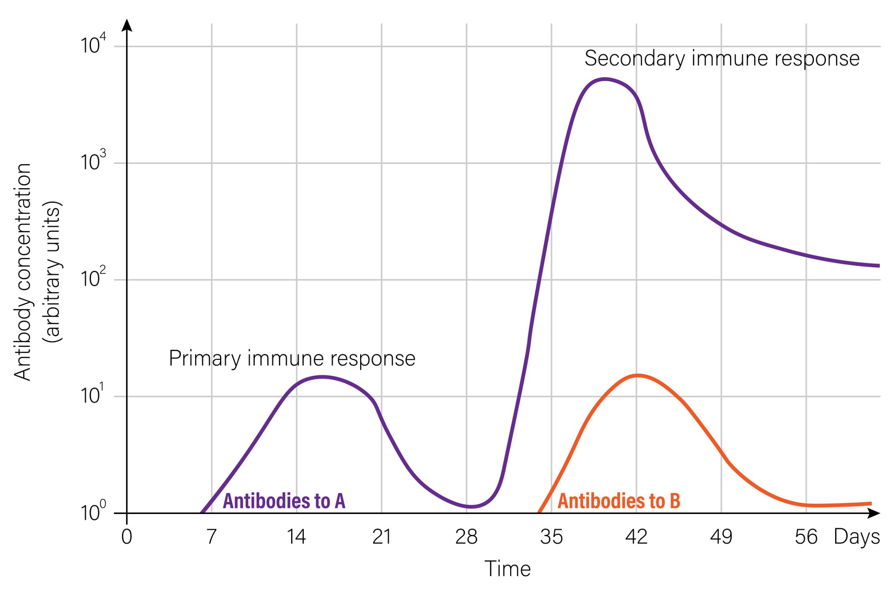

下面我把你这段“昨天第三节课”的录音转文字，**按老师讲课逻辑**做成一份能直接复习的笔记，同时把明显的**语音识别错词/错名**纠正掉（比如“撕裂源”其实是**丝裂原 mitogen**）。

---

## 0）先把关键词纠错（避免你背错）

* **体液免疫应答**（你文里多处被识别成“碘异杂当/体液点异杂”之类）
* **TD 抗原**：T-dependent antigen，**胸腺依赖性抗原**
* **TI 抗原**：T-independent antigen，**胸腺非依赖性抗原**
* **TI-1 / TI-2 抗原**：两类 TI 抗原
* “**撕裂源**”= **丝裂原 mitogen**（能非特异性诱导淋巴细胞增殖的东西）
* **LPS**（脂多糖）是经典的 **B 细胞丝裂原**，也常作为 **TI-1 抗原**的代表
* **CD40 在 B 细胞上；CD40L（CD154）在活化 T 细胞上**
* **BCR 交联（cross-linking）**：多个 BCR 同时被重复表位拉在一起，信号会强很多
* **补体片段 C3d + B 细胞 CD21（CR2）**：是 B 细胞“共受体放大器”（BCR-CD19-CD21-CD81 复合体）

---

## 1）这节课核心：B 细胞对抗原的应答总览（TD vs TI）

### A. B 细胞活化的“信号观”（老师反复强调）

* **第一信号（特异性）**：BCR 识别并结合抗原表位（+ 交联更强）
* **第二信号（协同刺激，不唯一）**：最经典的是 **CD40（B）-CD40L（T）** + T 细胞分泌细胞因子
  但老师也强调：第二信号不只这一种，**固有免疫通路也能“补第二信号”**（例如 TI-1 的 LPS 相关信号）

---

## 2）TD 抗原应答（你开头说的“30万、识别、双信号、浆细胞、抗体”那一大段）

**TD 抗原的典型本质：蛋白抗原**（因为 TCR 只能识别“肽-MHC”，所以 TD 必然是能被处理成肽段的东西）

**流程（按老师讲的那条线）：**

1. BCR 特异性结合 TD 抗原 → 内吞加工
2. 抗原肽装载到 **MHC II** → 呈递给 **CD4⁺ 辅助性 T 细胞（尤其 Tfh）**
3. T 细胞提供关键帮助：

   * **CD40L-CD40**（强第二信号）
   * 细胞因子（决定抗体类型转换方向）
4. B 细胞增殖分化 → **浆细胞产生抗体**
5. 进一步会发生（考试常考串联）：

   * **生发中心反应**
   * **类别转换（IgM→IgG/IgA/IgE）**
   * **体细胞高频突变** + **亲和力成熟**
   * **形成免疫记忆（记忆 B 细胞）**

> 你后面讲“再次应答里：高频突变、亲和力成熟、类型转换更明显”——就是在讲 TD 的生发中心这套升级系统。

---

## 3）TI 抗原应答：TI-1 vs TI-2（老师让你们“对着图看差别”的那段）

TI 的共同点（老师总结的“像固有免疫一样快”）：

* **不需要 T 细胞帮助**（至少不依赖 Tfh 那套 CD40L 帮助）
* **起效快**（老师说 TD 激活 T 的链条慢，常要几天）
* **抗体特点偏“快餐”**：以 **IgM** 为主、亲和力偏低、类别转换和免疫记忆弱（或缺乏）

---

### A）TI-1 抗原（典型：LPS）

**结构特点（老师说的“一边 BCR，一边 LPS 受体”）：**

* 既有能被 **BCR** 识别的部分
* 又带有能触发固有免疫受体的部分（老师口径叫 “LPS 受体”；按免疫学常用说法对应 **TLR 相关识别**）

**老师讲的“高浓度 vs 低浓度”现象（很像考点）：**

* **高浓度 TI-1**：
  LPS/丝裂原成分太多 → **不挑 BCR 特异性** → 只要有相应受体就被带着扩增 → **多克隆（polyclonal）B 细胞激活**
* **低浓度 TI-1**：
  抗原量不够“乱点鸳鸯谱” → 更依赖 **BCR 的特异性结合** → 相对更“挑”能识别该表位的 B 细胞克隆

**信号解释（老师的口径）：**

* 仍然可以理解为“两个信号”：

  * 信号1：BCR-抗原
  * 信号2：来自 TI-1 自带的“固有免疫刺激成分”（老师说“弱一点但能顶上”）
    → 所以 **无需 T 细胞**也能让 B 细胞活化、分化、产抗体

---

### B）TI-2 抗原（典型：重复多糖/荚膜多糖）

**结构特点：**

* **没有 LPS 那种“丝裂原/固有刺激成分”**
* 但有 **大量重复表位** → 能把很多 BCR “串联”起来
  → **强交联（cross-linking）** 使 BCR 信号非常强

**老师强调的点：**

* TI-2 主要靠“表位重复 → BCR 交联够强”，所以看起来“更像只靠第一信号就能冲起来”
* 产生的抗体多为 **IgM**，**无/弱类别转换、无/弱免疫记忆** → 非常符合“固有免疫风格”

**临床联系（老师举的“小孩容易反复感染”的那段核心意思）：**

* 很多细菌表面/荚膜是重复多糖结构 → 正是 TI-2 的典型形态
* 婴幼儿对这类抗原的有效应答能力较弱，随着免疫系统成熟会改善（老师举了学龄前容易反复发热/上学后好转的现象）

> 小提醒：老师说“5岁才成熟”更像是课堂的经验口径；不同教材对“多大算成熟”表述会有差异。复习应试时建议**以你们老师口径为准**，别跟出题人硬刚。

---

## 4）初次应答 vs 再次应答（老师那张曲线图）

**潜伏期（lag phase）**：接触抗原 → 到能检测到抗体出现的这段时间

对比记忆（直接背成对照点最省事）：

* **初次应答**：潜伏期长、上升慢、峰值低、维持短；以 **IgM** 为主，后期才出现一些 IgG
* **再次应答**：潜伏期短、上升快、峰值高、维持久；以 **IgG（或已转换的类型）** 为主，亲和力更高
  → 对应老师后面说的：**高频突变、亲和力成熟、类别转换**在再次应答更突出

---

## 5）老师顺带拔高：固有免疫 vs 适应性免疫怎么“捆绑运行”

老师用的几个非常经典的“互相依赖”例子，你可以直接当论述题素材：

* **固有免疫启动适应性免疫**：
  **DC** 是点燃 T 细胞应答的“第一枪”（没有 DC，T 难以有效活化）
* **固有免疫决定适应性免疫走向**：
  DC/先天信号环境不同 → Th 分化方向不同（老师举了 IL-12 推向 Th1、IL-4 推向 Th2 的思路）
* **抗体本身“杀不死东西”**（老师那句“死亡之吻”很形象）：
  抗体结合后，真正清除靠 **补体、吞噬细胞 Fc 受体介导的调理吞噬、ADCC** 等固有机制
* **趋化因子 + 黏附分子**决定细胞怎么“走到战场”：
  炎症环境诱导内皮表达黏附分子，趋化因子把中性粒/单核/T 细胞等引导进入局部

---

## 6）后半节课：超敏反应（变态反应）—你这段也非常完整

### A. 四型超敏反应的框架（老师要求掌握的四件套）

每一型都要能答：
1）概念/定义  2）机制  3）分类/特点  4）常见病

分型（老师口径）：

* **I 型：速发型/过敏反应**（IgE 介导）
* **II 型：细胞毒型**（IgG/IgM 针对细胞表面/基底膜等，引发补体或细胞效应）
* **III 型：免疫复合物型**（沉积→补体→炎症）
* **IV 型：迟发型**（T 细胞介导）

> 你们老师还说了一个“口径对照”：
> **超敏反应≈变态反应（旧称）**；而日常说“过敏”多数特指 **I 型**。

---

### B. I 型超敏反应（老师讲得最细，基本就是考试大题模板）

**1）关键角色：**

* 变应原（allergen）：能诱导机体产生特异性 **IgE** 并引发 I 型超敏的抗原
* 抗体：**IgE**（老师强调它“亲细胞性”，先找细胞再等抗原）
* 细胞：**肥大细胞（mast cell）**、**嗜碱性粒细胞**；晚期可见嗜酸性粒细胞参与
* 受体：IgE 的 **高亲和力受体 FcεRI**（肥大/嗜碱最典型）；低亲和力受体常在其他细胞更广泛表达（老师叫 R2）

**2）两阶段机制（强建议你按这两段背）：**

* **致敏阶段**（第一次接触）：
  变应原 →（B 细胞呈递+Th2 帮助）→ B 细胞类别转换 → 产生 IgE → IgE 通过 Fc 段“插旗”到肥大/嗜碱细胞表面
  → 得到“**被 IgE 武装过的肥大细胞**”
* **激发阶段**（再次接触同一变应原）：
  变应原把**两个或以上 IgE 交联**（cross-link） → 肥大细胞被激活 → **脱颗粒** + 合成新介质 → 出现症状

**3）介质（老师按“预先合成 vs 新合成”讲）：**

* **预先储存、立刻释放（速发相）**：组胺 + 相关酶类等
  → 来得快、去得也快
* **激活后新合成（迟发相）**：白三烯、前列腺素、血小板活化因子、细胞因子/趋化因子等
  → 招募更多炎症细胞，症状拖得更久

**4）典型生理效应（就是症状来源）：**

* 平滑肌收缩（如支气管痉挛、咳喘）
* 血管扩张、通透性增加（红、肿、水肿、荨麻疹、血管神经性水肿）
* 腺体分泌增加（流涕、流泪）
* 感觉神经刺激（痒）

**5）老师提到的几个经典点：**

* **补体过敏毒素**：C3a、C5a 可促肥大细胞等反应，并招募炎症细胞
* **青霉素“半抗原”**：本身免疫原性弱，但与体内蛋白结合后成为“完全抗原”样结构 → 可诱导 IgE → 严重者过敏性休克
* 一代抗组胺药嗜睡、二代相对少（老师用来解释“组胺是关键介质”）

---

### C. 诊断与防治（老师最后那段）

**诊断思路：**

* 病史最重要（可疑变应原、暴露场景、发作规律）
* **皮肤点刺/划痕试验（skin test）**
* **血清特异性 IgE 检测**（实验室法）

**防治：**

* 最根本：**查明变应原 → 避免接触**
* 脱敏两种（老师分得很清楚）：

  * **免疫血清/药物快速脱敏**：短间隔、小剂量逐步增加 → 先“耗掉/占位”致敏细胞的反应阈值 → 再足量给药
  * **变应原脱敏（免疫治疗）**：长期小剂量反复暴露，诱导更“温和/阻断性”的抗体反应（老师用“让它更偏 IgG、别去交联 IgE”来解释）

---

## 7）老师的“卫生假说”总结成一句话（写论述题好用）

婴幼儿早期免疫环境更偏 **Th2**（与妊娠期免疫耐受倾向有关），若成长环境过于“无菌”、微生物刺激不足，则 **Th1/Th2 平衡更难拉回**，更容易在过敏体质方向发展；适度的微生物暴露可能促进免疫调节趋于平衡，从而降低部分过敏性疾病风险。

---

如果你接下来要应试，我建议你把这份笔记里最可能出题的点，直接做成三类卡片：
1）**对比卡**（TD vs TI；TI-1 vs TI-2；初次 vs 再次；四型超敏）
2）**流程卡**（I 型超敏两阶段；TD 应答链条）
3）**名词解释卡**（变应原、致敏、交联、速发相/迟发相、半抗原等）

你后面继续把“今天/下一节课”录音贴出来也行，我会按同样标准给你整理成一套连续、可背诵、可做题的版本。

[1]: https://chatgpt.com/c/693900cd-ff30-8323-922c-3d2addf6dd8c "课堂笔记整理"
[2]: https://chatgpt.com/c/69463a1f-5ba4-8324-9df0-115d31e7bcc9 "课堂笔记整理"
[3]: https://chatgpt.com/c/6939878c-1cb4-8323-84d6-aaf8e00130b8 "课堂笔记整理指南"
