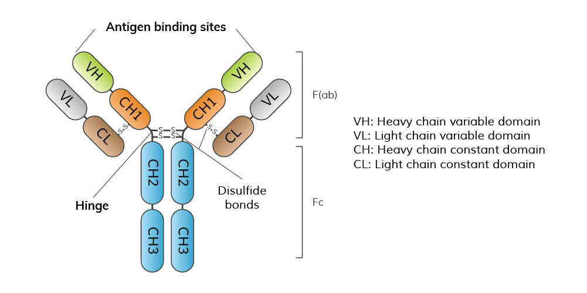

## 一、小测与复习节奏提醒（课前/导入）

* 小测做完就能看答案，用来**立刻巩固**知识点。

* 昨天已学：免疫学序论、免疫器官（immune organs）、抗原（antigen）的一部分。

* 老师的讲课顺序：**抗原 → 免疫系统/免疫器官 → 免疫分子（immune molecules）**；今天把抗原讲完，继续讲**免疫球蛋白/抗体**（immunoglobulin/antibody），后续还有**补体**（complement）、**MHC**、（以及各种 **CD 分子**等）。

* 【学习建议】免疫“信息量大、碎片化强”：

  * 课前预习 + 课堂认真听 = 相当于学两遍
  * 当晚再背一遍 = 第三遍
  * 周末把本周内容再过一遍
  * 否则拖到期末前会“连滚带爬”式突击，且多为短时记忆。

* 老师提到：他会在课程结束前（约两周内）把**2024 执业医师考试免疫学大纲**和相关习题上传资料区，帮助大家知道“将来会用到什么”。

---

## 二、课件勘误与关键意识：抗原 vs 表位（epitope）

* 老师因同学课后提问，**重新调整并上传了抗原 PPT**，并在图上标注：

  * **B 细胞受体**：BCR（B cell receptor，膜免疫球蛋白的一种）
  * 游离的抗体（antibody）也能结合 **B 细胞表位（B-cell epitope）**
  * 抗原经 **抗原提呈细胞** APC（antigen-presenting cell）加工后变成小片段（抗原肽）
  * 抗原肽由 **MHC**（major histocompatibility complex）分子“提呈”给 **TCR**（T cell receptor）
* 【易错】老师强调一个“思维纠偏”：

  * **凡是与抗体 / BCR / TCR 结合的，其实都是“表位（epitope）”，不是整个抗原本体。**
  * 口头上常说“结合抗原”，但严格讲应是“结合表位”。

---

## 三、【复习】抗原基本概念与“半抗原-载体效应”（hapten-carrier effect）

* 抗原两个基本特性：

  1. **免疫原性**（immunogenicity）：能诱导免疫应答
  2. **免疫反应性/抗原性**（immunoreactivity / antigenicity）：能与免疫产物特异结合
* **半抗原（hapten）**：只有“免疫反应性”，**没有免疫原性**（老师让大家牢牢记住）。
* 为什么强调**半抗原-载体效应**（hapten-carrier effect）：

  * 临床应用相关
  * 机理提示：半抗原本质上对应 **B 细胞表位**，但要引发完整体液免疫应答需要 **T 细胞辅助**，因此需要带有 **T 细胞表位** 的载体蛋白（carrier protein）。
  * 老师说：现在可能不完全理解，学到免疫应答（immune response）会更清楚；课堂会逐步“渗透”这个逻辑。

---

## 四、共同表位（shared epitope）→ 交叉反应（cross-reaction）及意义

### 4.1 定义链条（老师按词解释）

* **共同抗原表位/共同表位**（shared epitope）：不同抗原中含有相同或相似的表位
* **共同抗原**（common antigen）：含有共同表位的不同抗原
* **交叉反应**（cross-reaction）：抗体或活化淋巴细胞能与不同抗原的共同表位结合，从而诱导反应

### 4.2 【举例】牛痘疫苗与天花（经典交叉保护）

* 接种牛痘疫苗后诱导体液免疫应答（humoral immune response），产生**记忆 B 细胞**（memory B cell）。
* 多年后若接触天花病毒，记忆 B 细胞迅速活化、增殖、分化，产抗体中和病毒表面表位。
* 老师强调：图中“十字/符号”代表共同表位，机制核心是交叉反应。

### 4.3 【临床关联】感冒后肾炎/风湿性心脏病（老师用 A 族链球菌举例）

* 感冒后约 2–3 周出现肾炎：老师解释为

  * **A 族溶血性链球菌**（Group A hemolytic Streptococcus）某些成分与**肾小球基底膜**存在共同抗原/共同表位
  * 抗体因交叉反应结合肾小球基底膜 → 激活补体 → 旁观者组织受损 → 炎症 → 肾小球肾炎
  * 老师提示：这属于“三型超敏反应”（Type III hypersensitivity），后续会讲
* 也可出现风湿性心脏病：共同抗原涉及**心肌间质/心瓣膜**。

### 4.4 【临床关联】梅毒检测的“交叉抗原思路”

* 老师提到检验科可利用共同抗原/交叉反应的思路用于**诊断或鉴定**：

  * 也可用“交叉抗原代替实际抗原”的策略（类比牛痘预防天花）。

---

## 五、影响抗原免疫原性的因素（immunogenicity determinants）

老师说：这一块不逐条细讲，但挑重点。

### 5.1 抗原自身理化性质（physical/chemical properties）

* 一般趋势：**蛋白质 > 多糖 > 核酸**（免疫原性强到弱）
* 分子量：通常**越大越强**（但并非唯一决定因素）
* 结构复杂度：越复杂越强；老师强调“带苯环的芳香族化合物”免疫原性更强
* 【举例】明胶（gelatin）：分子量大但氨基酸组成简单 → 免疫原性弱
* 【举例】胰岛素（insulin）：老师举例说分子量不大但含芳香族氨基酸 → 免疫原性较强
  -（注：老师口述分子量数字在转写里可能有误；这里只记录其“结构复杂度影响免疫原性”的用意。）

### 5.2 【考点】异物性（foreignness / non-self）

* 不是“体外来的就叫异物”，而是**免疫系统不识别/未建立耐受的**才算“异物”。
* 两种典型来源：

  1. **化学结构与宿主自身不同**
  2. 胚胎期/幼年免疫活性细胞**从未接触过**的物质（未建立耐受）
* 【举例】“农村放养 vs 城市洁净”与过敏：

  * 早期接触抗原多 → 更容易形成**免疫耐受（immune tolerance）** → 过敏更少
  * 城市过度消毒 → 接触抗原少 → 更易过敏
* 老师提到理论：**卫生假说**（hygiene hypothesis），并用一句“越脏越好（the dirtier the better）”来概括其现象描述。
* 亲缘关系：亲缘越远 → 异物性越强；同种不同个体 → 器官移植排斥等问题。

### 5.3 改变的自身成分 & 隐蔽自身抗原（sequestered self antigen）

* **自身成分变性/修饰**后免疫系统“不认识” → 成为自身抗原（autoantigen）

  * 老师举例：IgG 结构变性后可成抗原
* **隔离屏障**导致“从未接触免疫系统”的自身成分：

  * 血脑屏障（blood-brain barrier）、血眼屏障（blood-ocular barrier）、血睾屏障（blood-testis barrier）
  * 外伤/破坏屏障 → 释放入血 → 触发免疫攻击
* 【临床关联】交感性眼炎（sympathetic ophthalmia）：

  * 一侧贯通伤多年后，健侧也可能受累失明（老师用来说明隐蔽自身成分被攻击）
* 【临床关联】外伤后男性不育：

  * 精子/精蛋白（sperm antigens）原本被血睾屏障隔离，外伤后暴露 → 产生自身抗体/效应 T 细胞 → 不育风险

### 5.4 抗原剂量与进入途径（dose & route）

* 剂量：太低不行，太高也不行，需“中间地带”
* 途径强弱（老师按“更容易诱导免疫应答”排序）：
  **皮内（intradermal） > 皮下（subcutaneous） > 肌注（intramuscular） > 静注（intravenous） … > 口服（oral）**
* 【考点】为何有些药物注射要皮试、口服不用？

  * 老师强调关键点：**口服免疫原性最弱**，且更容易形成**肠道免疫耐受（oral tolerance）**。
* 【举例】婴幼儿食物过敏：部分食物早期可能过敏，后续逐步接触可缓解 → 与耐受建立有关。

### 5.5 疫苗后“短期不适”与佐剂/溶剂（adjuvant/solvent）

* 老师用新冠疫苗体验举例：注射后 1–3 天胳膊沉、低热等
* 观点：**适应性免疫应答（adaptive immune response）需要时间**，真正“免疫应答导致的大问题”常在**两周后**更符合时间规律
* 早期反应多与**佐剂（adjuvant）或溶剂（solvent）**等相关（老师后面会再讲佐剂）

### 5.6 宿主因素（host factors）

* 遗传/个体差异：老师点名 **MHC / HLA**（人的 MHC 叫 HLA），影响提呈与应答能力
* 年龄：儿童/老人应答特征不同（老师也用 SARS 作对比解释）
* 性别：自身免疫病女性高发

  * 类风湿关节炎（RA）男女约 1:7
  * 系统性红斑狼疮（SLE）约 1:10
  * Graves 病（自身免疫性甲亢）也多见于女性
  * 老师给出的解释：激素因素 + 女性经历月经/分娩等感染暴露机会更多 → 抗体诱导能力更强
* 健康状态：略

---

## 六、课堂小题点到：哪些“具有免疫原性/抗原性”？

* 眼晶状体蛋白：有（隐蔽自身成分，外伤暴露后可成抗原）
* 骨折内固定钢板：通常无（材料惰性），但极端过敏体质需注意
* 青霉素降解产物/青霉烯酸：老师说其多为**半抗原（hapten）**
* 核酸：老师强调“弱/无”（他也提到 mRNA 疫苗相关讨论）
* 心脏支架、膝关节置换：与材料学发展相关，现代多追求低免疫原性；个别体质仍可能反应

---

## 七、抗原分类（按老师出现顺序）

### 7.1 按是否需要 Th 细胞参与诱导抗体：TD vs TI

* **辅助性 T 细胞**：Th（helper T cell）
* **TD 抗原（T-dependent antigen）**：

  * 多为蛋白质，结构复杂，表位多
  * 既有 **B 细胞表位** 又有 **T 细胞表位**
  * 体液免疫 + 细胞免疫都可诱导（老师强调“两个都有”）
  * 与 **MHC 限制性（MHC restriction）**相关
* **TI 抗原（T-independent antigen）**：

  * 多为多糖/脂多糖等，常呈重复表位
  * 主要是重复的 **B 细胞表位**
  * 直接诱导 B 细胞产生**低亲和力 IgM**（low-affinity IgM），偏体液免疫，不引起细胞免疫（老师的概括）
* 【复习连接】半抗原-载体效应与 TD 抗原逻辑一致：

  * 半抗原（B 表位） + 载体蛋白（T 表位）→ 才能获得 Th 辅助 → 完整体液免疫应答

### 7.2 按与机体亲缘关系：异嗜性/同种异体/自身/新生

* 【考点】异嗜性抗原：heterophile antigen

  * 转写里出现 “HYDROPHILIC（亲水）”，按语境应为 **heterophile（异嗜性）**
  * 定义：存在于不同种属（人/动物/微生物）间的共同抗原
* 同种异体抗原（alloantigen）：如 ABO 血型抗原、HLA
* 自身抗原（autoantigen）：自身成分改变或隐蔽成分释放
* 新生抗原（neoantigen）：如肿瘤细胞表达的新表位
* 【临床关联】破伤风抗毒素（tetanus antitoxin）制备与过敏风险：

  * 外毒素经甲醛处理去毒保留免疫原性 → **类毒素（toxoid）**
  * 免疫动物（老师强调常用马）取抗血清 → 供急诊使用
  * 给人注射马来源抗毒素：既是抗体又是抗原（异种抗原）→ **必须皮试**
  * 皮试阳性仍需用：老师提到“过去常用”**脱敏疗法（desensitization）**：小剂量、短间隔、多次注射（原理后续在 I 型超敏反应讲）

### 7.3 按 APC 内抗原来源：内源性 vs 外源性

* 老师提醒：这和他昨天说的“细胞外抗原/细胞内抗原”不是一回事
* **内源性抗原（endogenous antigen）**：如病毒感染后在细胞内复制产生的成分、肿瘤抗原
* **外源性抗原（exogenous antigen）**：被吞噬细胞（如巨噬细胞 macrophage）摄取后加工提呈的抗原

  * 老师用词源趣讲：macro-（大）+ -phage（吃）→ “大吃货”

---

## 八、非特异性免疫刺激剂（老师强调：第八版教材删减多，但仍要懂）

### 8.1 超抗原（superantigen）

* 特点：极少量即可**非特异性**强烈激活大量 T 细胞克隆（老师给范围 2%–20%）
* 与普通抗原不同：不需要 APC 经典加工提呈过程，只需“桥接”即可（老师用“搭桥”比喻）
* 结果：大量细胞因子（cytokines）释放 → **细胞因子风暴（cytokine storm）** → 高热、多器官衰竭
* 【举例】老师用 2003 SARS 解释“上午还好、下午人没了”的机制框架：并非单纯病毒毒性，而可能是免疫过强导致的灾难性反应（老师的课堂解释）。

### 8.2 佐剂（adjuvant）

* 定义：与抗原同时或预先注入，可增强免疫应答强度或改变应答类型的非特异性增强物质
* 老师举例：铝佐剂（aluminum adjuvant，如氢氧化铝 aluminum hydroxide）；也提到疫苗多次肌注程序
* 生物性佐剂：卡介苗（BCG），并提到“BCG 治疗膀胱癌”作为应用提示

### 8.3 丝裂原（mitogen）与淋巴母细胞转化（lymphoblast transformation）

* 丝裂原：能直接促使免疫细胞活化、增殖、分化（促进有丝分裂）
* 转化表现：淋巴细胞体积变大、核/核仁变化 → “母细胞化”
* 【实验思路】做药物“增强免疫/抗肿瘤候选”筛选：

  * 取小鼠脾（脾是最大免疫器官）制备细胞
  * 以特定丝裂原作为阳性对照（positive control）

    * T 细胞丝裂原：刀豆蛋白 A（Concanavalin A, ConA）
    * B 细胞丝裂原：脂多糖（LPS，老师强调对小鼠更典型），以及 PWM、SPA 等
  * 看药物是否能比阳性对照更强地促进增殖/转化 → 作为 candidate（候选）

---

## 九、【阶段小结】抗原部分老师收束的要点清单

* 抗原 antigen（缩写 **Ag**）
* 两个基本特性：免疫原性（immunogenicity）、免疫反应性（immunoreactivity）
* 完全抗原 vs 半抗原（complete antigen vs hapten）、半抗原-载体效应（hapten-carrier effect）
* 特异性关键在表位（epitope）：线性/构象（linear/conformational）、T 细胞表位/B 细胞表位
* 共同表位、交叉反应（shared epitope & cross-reaction）
* 影响免疫原性因素、抗原分类：TD/TI、异嗜性抗原等
* 非特异性免疫刺激剂：超抗原、佐剂、丝裂原

---

## 十、考试与小测提醒（出现在转入抗体前）

* 免疫部分会有一次小测，由陈老师最后组织：**10 道选择题计入平时成绩**
* 老师说：他和陈老师各出 5 道题；寄生虫部分也会有小测；合计 3 次计入平时成绩

---

## 十一、进入免疫分子：抗体/免疫球蛋白（antibody / immunoglobulin）

### 11.1 用临床场景引入“抗体功能：中和（neutralization）”

* 针刺伤/职业暴露：针头刚给乙肝患者用过 → 可能接触乙肝病毒（HBV）

  * 老师强调乙肝病毒顽固，清洗未必可靠
  * 处理思路：尽快“阻断”

    * 乙肝：可注射乙肝相关抗体（临床上常指 HBIG，hepatitis B immunoglobulin）进行紧急预防/治疗（老师的课堂说法）
* HIV 暴露/高风险性行为：尽快用阻断药（PEP, post-exposure prophylaxis）
* 体质弱/抵抗力低：可用**丙种球蛋白**（IVIG, intravenous immunoglobulin）增强被动免疫

  * 老师举真实故事：某院长为高龄母亲定期注射丙球以增强抵抗力（强调“资源与现实”）

### 11.2 【考点】抗体定义（老师说他爱考）

* **抗体 antibody（Ab）**：

  * B 细胞受抗原刺激后活化 → 分化为浆细胞（plasma cell）
  * 产生并分泌的一类免疫球蛋白 **Ig（immunoglobulin）**
  * 与抗原（严格讲表位）特异性结合，是体液免疫应答的重要效应分子

### 11.3 【考点】免疫球蛋白定义（老师说也爱考）

* **免疫球蛋白 immunoglobulin（Ig）**：

  * 具有抗体活性，或化学结构与抗体相似的一类球蛋白
* 老师强调：第八版教材倾向把“抗体 = 免疫球蛋白”默认等同；答题时从功能或结构角度表述均可。

### 11.4 抗体的两种存在形式

* 分泌型/游离抗体（secreted antibody）：在体液中游走
* 膜免疫球蛋白（membrane Ig, mIg）：如 **BCR**（膜上的抗体样分子）

---

## 十二、抗体基本结构（以 IgG 单体为例，老师开始讲结构域）

### 12.1 总体形态与连接方式

* IgG 单体常画成 “Y” 形
* 由 **2 条重链（heavy chain, H）+ 2 条轻链（light chain, L）** 组成，对称分布
* 链与链之间用 **二硫键（disulfide bond）** 连接
* Y 的“上端”是 **氨基端（N-terminus）**，“下端”是 **羧基端（C-terminus）**

### 12.2 可变区与恒定区（V region & C region）

* 轻链：**VL（variable light）** + **CL（constant light）**
* 重链：**VH（variable heavy）** + **CH1、CH2、CH3**（IgM/IgE 还有 **CH4**）
* 关键区别（老师用“为什么能变”提问引导）：

  * **V 区**：为适配不同抗原表位，氨基酸序列高度可变 → 产生多样性（diversity）
  * **C 区**：同一种属相对保守（恒定），决定“类属/型别相关功能基础”（老师此处先点到“恒定”的概念）

### 12.3 高变区/超变区/互补决定区（hypervariable regions / CDRs）

* V 区内部真正变化最大的是：

  * 高变区/超变区（hypervariable regions）= **互补决定区 CDR（complementarity-determining regions）**
  * 常写作 **CDR1、CDR2、CDR3**
* 其余相对稳定部分称：

  * **骨架区（framework region, FR）**
* 老师强调：CDR 直接参与结合表位（epitope），因此必须高度可变；FR 提供结构“骨架”支撑。

### 12.4 免疫球蛋白结构域与“超家族”（Ig domain / Ig fold / Ig superfamily）

* 抗体结构可画成一个个球形“结构域”（domain）
* 这种折叠方式叫 **Ig fold（免疫球蛋白折叠）**
* 很多免疫分子也具有类似 Ig domain，因此归为 **免疫球蛋白超家族（immunoglobulin superfamily, IgSF）**

  * 老师点名：TCR、MHC、CD 分子等后续会遇到类似结构域

---

# 本节英文术语索引（中文 – 英文/缩写）

* 抗原 – antigen（Ag）
* 免疫原性 – immunogenicity
* 免疫反应性/抗原性 – immunoreactivity / antigenicity
* 表位 – epitope
* B 细胞表位 – B-cell epitope
* T 细胞表位 – T-cell epitope
* 线性表位 – linear epitope
* 构象表位 – conformational epitope
* 半抗原 – hapten
* 载体效应 – hapten-carrier effect
* 抗原提呈细胞 – antigen-presenting cell（APC）
* 主要组织相容性复合体 – major histocompatibility complex（MHC）
* 人类白细胞抗原 – human leukocyte antigen（HLA）
* T 细胞受体 – T cell receptor（TCR）
* B 细胞受体 – B cell receptor（BCR）
* 辅助性 T 细胞 – helper T cell（Th）
* T 依赖性抗原 – T-dependent antigen（TD antigen）
* T 非依赖性抗原 – T-independent antigen（TI antigen）
* 共同表位 – shared epitope
* 交叉反应 – cross-reaction
* 免疫耐受 – immune tolerance
* 卫生假说 – hygiene hypothesis
* 内源性抗原 – endogenous antigen
* 外源性抗原 – exogenous antigen
* 超抗原 – superantigen
* 细胞因子风暴 – cytokine storm
* 佐剂 – adjuvant
* 铝佐剂/氢氧化铝 – aluminum adjuvant / aluminum hydroxide
* 卡介苗 – BCG
* 丝裂原 – mitogen
* 淋巴母细胞转化 – lymphoblast transformation
* 刀豆蛋白 A – Concanavalin A（ConA）
* 脂多糖 – lipopolysaccharide（LPS）
* 抗体 – antibody（Ab）
* 免疫球蛋白 – immunoglobulin（Ig）
* 膜免疫球蛋白 – membrane immunoglobulin（mIg）
* 浆细胞 – plasma cell
* IgG/IgM/IgE – IgG / IgM / IgE
* 重链/轻链 – heavy chain（H）/ light chain（L）
* 二硫键 – disulfide bond
* 可变区/恒定区 – variable region（V）/ constant region（C）
* 互补决定区 – complementarity-determining region（CDR）
* 骨架区 – framework region（FR）
* 结构域 – domain
* 免疫球蛋白折叠 – Ig fold
* 免疫球蛋白超家族 – immunoglobulin superfamily（IgSF）
* 丙种球蛋白 – intravenous immunoglobulin（IVIG）
* 暴露后预防 – post-exposure prophylaxis（PEP）

（以上索引仅收录老师本段讲到或明确点名的核心术语，不改变正文时间线。）