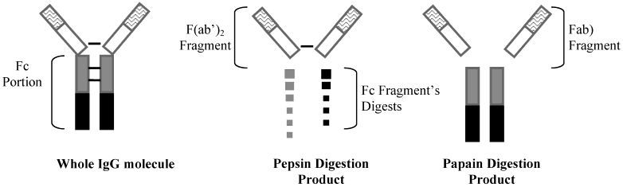

# 免疫学课堂笔记（按老师讲课时间线整理）

主题：**抗体/免疫球蛋白（Antibody / Immunoglobulin）结构与功能** → **补体系统（Complement system）导入与三条激活途径+功能**

---

## 一、【教材更新提醒】第八版教材的调整 + 课程沟通方式

* 老师强调：本课有一部分内容按**今年刚出的《免疫学》第八版教材**讲，和同学手头的旧讲义/资源**不完全一致**。
* **变化点（很重要）**：

  * “免疫系统识别体内损伤、衰老、死亡细胞”的内容，过去常放在**免疫监视（immune surveillance）**里；
  * **第八版教材把它归到“免疫自我（immune self）”**：因为这类细胞识别/清除功能若异常，更可能与**自身免疫病（autoimmune disease）**相关。
  * 【易错】有些表格/材料可能把“衰老/死亡细胞”放在别处（如免疫系统功能/免疫监视），**以新版教材归类为准**。
* 【学习建议】提问方式：不必加微信，可直接在**学习通私信**老师；老师可能忙但通常会在当天（哪怕很晚）回复。

---

## 二、【复习】上周内容回顾：抗体 vs 免疫球蛋白（Ig）概念统一

* 上周讲了：绪论、免疫器官、抗原（Antigen），并介绍了一部分抗体内容。
* 【概念更新】第八版教材中：

  * **抗体（antibody）= 免疫球蛋白（immunoglobulin, Ig）**（视为等同概念）。
  * 旧观点里会说“抗体是免疫球蛋白，但免疫球蛋白不一定都是抗体”；老师强调新版里按“等同”掌握即可。
* Ig 的两种存在形式（老师用“海陆空/载体”类比）：

  1. **游离型**：在体液中游离的 Ig（相当于“海军”）
  2. **膜型**：B 细胞表面的 **膜免疫球蛋白（membrane Ig）**，作为 **BCR（B cell receptor）**

---

## 三、【复习】以 IgG 单体为例：抗体基本结构与“分段计算”

* IgG 单体：**2 条重链（heavy chain）+ 2 条轻链（light chain）**，对称 **Y 形**。
* 结构分区：

  * **可变区（Variable region, V区）**：决定抗原特异性
  * **恒定区（Constant region, C区）**：决定类别/效应功能
* 老师用“长方块/比例”帮助记忆结合区与恒定区的构成（核心意思）：

  * **抗原结合位点**由 **轻链的一部分 + 重链的一部分**共同形成（本质：VH+VL 共同构成结合面）。
  * 【易错】不同 Ig 类别重链恒定区结构域数不同：

    * IgG/IgA/IgD 常见恒定区结构域较“短”
    * **IgM、IgE**重链恒定区多一个结构域（常写 **CH4**），所以“比例/分段”会不一样（老师用 4/5 的说法提示“下面多一段”）。

---

## 四、球形结构域 + 免疫球蛋白超家族（Ig superfamily）

* 真实蛋白是 3D 折叠结构；为便于理解，教材常把 Ig 的结构画成一个个**球形结构域（Ig-like domain）**。
* 引入概念：**免疫球蛋白超家族（immunoglobulin superfamily）**

  * 后续会遇到很多分子也长这个“球形结构域”样子：如 **TCR、CD4** 等
  * 这些分子也有类似的 **V 区、C 区**结构逻辑。

---

## 五、超变区/互补决定区：CDR、HVR 与表位（Epitope）

* 抗体结合抗原的关键区域：

  * **CDR（complementarity-determining region，互补决定区）**
  * 也称 **HVR（hypervariable region，超变区）**
* 为什么“超变”：抗原表位千变万化 → 结合区氨基酸序列也需要高度多样。
* 老师强调：在讲的是 **B 细胞表位（B-cell epitope）**，多为抗原表面的三维结构决定：

  * **构象表位（conformational epitope）**：由空间构象形成的表位（不是简单线性序列）
* 结合价（valency）例子：

  * **IgG 单体有 2 个抗原结合位点** → 可结合 **2 个表位**（老师用“两只手/四个手掌”的比喻帮助想象“两个臂端可结合”）

---

## 六、重链/轻链类型与亚类：为后续 Fc 受体/补体做铺垫

* 重链类型（决定 Ig 类别）：**α（IgA）、γ（IgG）、μ（IgM）、δ（IgD）、ε（IgE）**
* 轻链类型：**κ（kappa）、λ（lambda）**
* Ig 的亚类（老师点到为止）：

  * **IgA 有 2 个亚类（IgA1/IgA2）**
  * **IgG 有 4 个亚类（IgG1–IgG4）**
* 【考点/伏笔】讲到补体经典途径时会用到：

  * **IgG 前 3 个亚类更容易参与激活补体**，**IgG4 通常不参与/能力弱**（老师提醒后面学补体会看到）

---

## 七、铰链区（Hinge region）：为何抗原结合后“补体位点暴露”

* **铰链区（hinge region）**：位于重链 **CH1 与 CH2**附近（老师强调“知道在哪一段附近即可”）
* 结构特点：富含某些氨基酸残基，使其**可弯曲/可转动** → 增强结合不同形状表位的灵活性。
* 老师讲的关键逻辑（非常重要）：

  * **抗原/表位未结合时**：补体结合位点相对“遮住”
  * **抗原-抗体结合后**：铰链区构象改变 → **暴露 Fc 区的补体结合位点** → 更易激活补体（Complement activation）
* 【易错】谁有铰链区、谁没有：

  * 老师强调：**IgM、IgE 没有铰链区**；其余（IgG/IgA/IgD）有。

---

## 八、J 链（J chain）与分泌片（Secretory component, SC）：聚合与黏膜运输

### 1）J 链：把单体连接成聚合体

* **J chain（J 链）** 作用：连接单体形成聚合体
* 例子：

  * **IgM**：分泌型常为**五聚体（pentamer）**

    * 理论结合表位数：10
    * 老师强调【易错】：空间位阻导致**真正有效结合数常达不到 10**，可理解为“上限被空间限制”（老师举到“最多约 5 个也很强”这种考试式说法）
  * **IgA**：可形成**二聚体（dimer）**

### 2）分泌片 SC：帮助 IgA 穿越上皮并抗降解

* **Secretory component（SC，分泌片）** 主要出现在 **分泌型 IgA（secretory IgA, sIgA）**
* 两个核心作用：

  1. **帮助 IgA 从黏膜基底侧转运到腔面**（老师说稍后会配图理解）
  2. **保护 IgA 抗酶降解**（黏膜环境酶多）

---

## 九、蛋白酶“切抗体”：Papain 与 Pepsin 的不同切法 + 临床意义

* 体内/体外酶可切割 Ig：

  * **木瓜蛋白酶 Papain**（老师纠正读法并提到 papaya 这个词）
  * **胃蛋白酶 Pepsin**

### 1）Papain 切割结果

* Papain 在铰链区上方切割 → 产生：

  * **2 个 Fab（antigen-binding fragment）**
  * **1 个 Fc（fragment crystallizable）**
* 每个 Fab：**只能结合 1 个表位**

### 2）Pepsin 切割结果

* Pepsin 在铰链区下方切割 → 产生：

  * **F(ab')₂**（老师口述为 “Fab’(2)”）：仍可**结合 2 个表位**（结合能力基本保留）
  * Fc 部分进一步被降解为小碎片（常写 pFc'，功能丢失）

### 3）【临床关联】破伤风抗毒素/抗体：为什么有的要皮试、有的不用

* 老师举急诊常见例子：**破伤风抗体/抗毒素（tetanus antitoxin）**
* 大量制备来源常为**马血清**：

  * 【易错】“抗体本身也可能成为抗原” → 异种蛋白可引发过敏，所以传统马血清制剂常需**皮试**。
* 如果皮试过敏但必须用：老师提到**脱敏疗法**思路：小剂量、多次、间隔注射。
* 关键点：若用 **Pepsin 消化**去掉“种属特异性强”的 Fc 等部分、保留 F(ab')₂ 的结合能力 → **免疫原性下降**

  * 老师结论式强调：这种处理后的制剂**往往不需要皮试**（临床更常用但价格更高）。
* 老师补充：急诊可见多种来源/工艺的破伤风抗体，**价格不同**，选择取舍不同。

---

## 十、【总结复习】V 区与 C 区的功能分工（结构 → 功能）

* **V 区（VH + VL）**：特异性识别并结合抗原表位（epitope）
* **C 区（尤其 Fc 段）**：决定“属性/类别/效应功能”，包括：

  * **激活补体（complement fixation/activation）**：如 IgG 的 CH2、IgM 的 CH3 等与补体相关
  * **与 Fc 受体（Fc receptor, FcR）结合**：介导吞噬、ADCC 等
  * **IgG 可通过胎盘**：老师讲“胎盘 Fc 受体”（常写 **FcRn**）→ 母体 IgG 进入胎儿，提供保护
  * **调理作用（opsonization）**：促进吞噬（后面详讲）

---

## 十一、【考点】抗体五大功能（老师强调“年年考、解答题最爱出”）

> 老师的总体观点：**抗体自己“没力气”直接清除抗原**，要么“阻断”，要么“借刀杀人”（借补体/细胞）。

### 1）中和/阻断（Neutralization）

* 抗体结合病毒或毒素 → **阻断其与宿主受体结合**
* 【举例】新冠（COVID-19）例子：研究哪些细胞表达受体，抗体的意义是**阻断病毒-受体结合**。
* 【临床关联】康复者血浆：理论上可提供中和抗体，但实际效果受多因素干扰；老师提到“有争议”，但**理论逻辑成立**。

### 2）激活补体（Complement activation，经典途径相关）

* 抗原-抗体复合物形成后 → 暴露 Fc 位点 → 激活补体 → 形成膜攻击复合物打孔裂解。

### 3）调理作用（Opsonization）

* 抗体桥梁：抗体 Fab 结合病原体，Fc 结合吞噬细胞 FcR → 促进吞噬。

### 4）ADCC（antibody-dependent cellular cytotoxicity，抗体依赖的细胞介导细胞毒作用）

* 典型：**NK 细胞**通过 FcR 识别包被 IgG 的靶细胞（感染细胞/肿瘤细胞）
* NK 释放 **穿孔素（perforin）/颗粒酶（granzyme）** 等 → 诱导靶细胞死亡（老师也提到 Fas/FasL、TNF 等途径“机制类似”）

### 5）介导 I 型超敏反应（Type I hypersensitivity）

* **IgE** 结合肥大细胞/嗜碱性粒细胞表面的 FcεR
* 过敏原交联 IgE → **脱颗粒**释放组胺等介质 → 血管扩张、通透性↑、腺体分泌↑、支气管痉挛等
* 【举例】葱姜蒜等食物过敏；花粉季哮喘/通风诱发等

### 6）（老师随后补充的“功能点”）通过胎盘 + 黏膜局部保护

* **IgG 经胎盘转运**：母体给胎儿的自然被动免疫
* **sIgA 黏膜保护**：在黏膜表面、初乳等提供局部免疫（分泌片保护其不被降解）

> 【考试提醒（老师原话意思）】解答题写功能时：**中和、激活补体、调理、ADCC、I 型超敏、通过胎盘/黏膜保护**这些要会写全；有些细枝末节可不写，但**核心条目必须答全**。

---

## 十二、五类免疫球蛋白（IgG/IgA/IgM/IgE/IgD）特点（老师按“最独特点”要求记）

### 1）IgG

* **血清含量最高**
* 半衰期长；**再次体液免疫应答（secondary response）主要抗体**
* 抗感染主力：抗菌、抗病毒、抗毒素；常参与**调理、ADCC、经典途径激活补体**
* **可通过胎盘**：自然被动免疫（maternal IgG → fetus）

### 2）IgA / sIgA

* **黏膜免疫关键抗体**：呼吸道、消化道等“边防线”
* 分为血清型与分泌型：

  * **sIgA = IgA 二聚体 + J chain + secretory component（SC）**
  * 可结合 **4 个表位**
* 【临床关联】母乳/初乳含 sIgA → 保护新生儿；老师提到婴儿约前 6 个月相对更受保护，之后逐渐更多依赖自身免疫系统完善。

### 3）IgM

* **五聚体（pentamer）**，分子量最大；有 **CH4**
* 个体发育中/初次应答最先出现：**primary response 主要抗体**
* 早期感染“先锋部队”；也能强力激活补体经典途径
* **ABO 血型天然抗体**多为 IgM（老师强调点）

### 4）IgE

* 血清含量最低
* 抗寄生虫；与 I 型超敏反应密切（过敏体质 IgE 往往更高）
* 老师补充遗传倾向的粗略印象：过敏体质与家族史相关（并提到细胞因子如 IL-4 等与 IgE 相关内容后续视频会讲）

### 5）IgD

* 含量少、研究相对少
* 作为 B 细胞发育/分化标志之一：

  * **未成熟 B 细胞**：膜上主要 IgM
  * **成熟 B 细胞**：膜上 **IgM + IgD** 同时表达（作为成熟标志）

---

## 十三、【课堂提问小测式复盘】老师现场用题目带记忆点

* 早期抗感染主要抗体：**IgM**
* 胎儿/新生儿血中 Ig 升高的判断（老师带着想法走）：

  * **来自母体的 IgG**可经胎盘进入胎儿（被动免疫）
  * 新生儿自身免疫未完善，随时间母体 IgG 下降，靠自身逐步建立
* 人体“含量最高”的 Ig 的两个口径（老师区分得很典型）：

  * **血清含量最高：IgG**
  * **机体总量/黏膜相关总量很大：IgA**
* 哪些 Ig 有 J chain：**IgM、IgA（二聚体/分泌型）**
* IgE 高不一定“好/坏”，但与过敏/寄生虫相关，需要理解其生物学意义。

---

## 十四、单克隆抗体（Monoclonal antibody, mAb）概念与意义

* **单克隆抗体**：由**单一克隆杂交瘤细胞（hybridoma）**产生，只识别**某一特定抗原表位**的高特异性抗体。
* 对照：**多克隆抗体（polyclonal antibody）** 来自多个 B 细胞克隆，识别多个表位。
* 特点：纯度高、特异性强、可大量生产。
* 老师强调应用逻辑：仍然围绕抗体两大“做事方式”：

  * **阻断/中和**（neutralize/block）
  * **连接并借刀杀人**（complement / FcR / cells）

---

## 十五、【备考建议】老师对“怎么复习/怎么看材料”的指示

* 如果为了期末考试：优先看课件里**标红重点**；每章末尾**思考题/讨论题**要会背会用。
* 有理解问题：学习通私信老师/陈老师均可（限免疫学相关）。
* 老师回应同学担心：考试总体不难，英文可能更有难度；理解通了再刷题会更快。

---

## 十六、补体（Complement）导入：为什么紧接着抗体讲

* 老师一句话核心：**抗体要“借刀杀人”，这把刀就是补体**。

---

## 十七、补体概念与特点（老师强调抓“定义句”）

* 补体存在部位：**血清、组织液、细胞膜表面**等（“无处不在”）
* 本质定义：一组蛋白质，**经活化后具有酶活性**，引发级联反应。
* 补体是 **固有免疫（innate immunity）** 的重要组成，也可连接到适应性免疫（经典途径依赖抗体）。
* 【易错】教材标注差异：

  * 有的教材用“上划线/横线”表示“活化后的成分”（老师说现在可能取消了，别被符号吓到）
  * 前面有个 **i** 常表示 **inactivated（灭活）**（如 iC3b 这类写法，老师提醒看到别慌）

---

## 十八、【考点】补体三条激活途径（Classic / Alternative / Lectin-MBL）

> 老师要求先把三条途径“框架搞清楚”：**激活物质 → 转化酶（C3/C5）→ 共同末端 → MAC 打孔**

### 1）经典途径（Classical pathway）

* 【激活物质】**抗原-抗体复合物（immune complex, IC）**

  * 抗体主要是 **IgG 或 IgM**
* 【关键顺序记忆】老师给的“口令式”：

  * **C1 → C4 → C2 → C3 → C5 → C6 → C7 → C8 → C9**
  * 也可理解为：把“1-9发现顺序”里**把 4 调到 2、3 前面**
* C1 由 **C1q、C1r、C1s**构成：

  * C1q 负责识别结合 Fc
* 【易错】激活条件：

  * **只有抗体不行**，必须形成 **免疫复合物（IC）** 才能激活补体
  * **IgG**：通常需要**至少两个 IgG 分子**靠近才能有效激活 C1q
  * **IgM**：五聚体结构，一个 IgM 结合抗原后构象改变即可更有效激活 C1q（老师强调这一点）
* 关键转化酶：

  * **C3 转化酶：C4b2a**
  * **C5 转化酶：C4b2a3b**
* 共同末端：形成 **MAC（membrane attack complex）= C5b-9** → 打孔溶解

### 2）旁路/替代途径（Alternative pathway）

* 【激活物质】病原体表面成分（多糖、脂多糖、聚糖等）直接触发；**不依赖抗体**
* 老师强调“为什么 C3 含量最高”：替代途径**从 C3 开始**，用量大 → 血清 **C3** 含量最高
* 关键因子：**Factor B（B 因子）、Factor D（D 因子）、Properdin（P 因子）**
* 关键转化酶（常见写法）：

  * **C3 转化酶：C3bBb（可被 P 因子稳定）**
  * **C5 转化酶：C3bBb3b**
* 老师补充：C3 在生理状态有“自发水解/滴答（tickover）”趋势，但机体有调节机制避免无故激活，否则易自身免疫损伤（调节细节老师说先略过）。

### 3）MBL/凝集素途径（Lectin / MBL pathway）

* 【激活物质】病原体表面**甘露糖残基（mannose）**
* 关键分子：

  * **MBL（mannose-binding lectin）**：肝脏产生的急性期相关分子
  * **MASP（MBL-associated serine proteases）**：功能类似经典途径的 C1r/C1s
* 后续级联与经典途径高度相似：从 **C4、C2**进入

  * **C3 转化酶仍是 C4b2a** → **C5 转化酶 C4b2a3b** → **MAC（C5b-9）**

---

## 十九、补体功能（老师按“能干什么”总结）

### 1）细胞毒/溶菌溶细胞

* 通过 **MAC（C5b-9）** 在膜上打孔 → 渗透压失衡 → 裂解。

### 2）调理作用（Opsonization）+ 吞噬促进（联合调理）

* 既可以靠**抗体 Fc—FcR**桥梁，也可以靠**C3b—补体受体（CR）** 桥梁。
* 老师强调“联合调理”画面：

  * 细菌表面：有 **IgG** + 有 **C3b**
  * 巨噬细胞表面：有 **Fc receptor（FcR）** + 有 **Complement receptor（CR）**
  * 双重连接更强 → 更易吞噬、形成吞噬体→吞噬溶酶体→消化。

### 3）诱导炎症（Inflammation）/趋化（Chemotaxis）

* 补体裂解产生的小片段（老师点名）：

  * **C3a、C4a、C5a**：过敏毒素/炎症介质（anaphylatoxins）

    * 促肥大细胞等脱颗粒、释放组胺
    * 血管扩张、通透性↑，平滑肌收缩（如支气管痉挛），趋化吞噬细胞聚集等
* 老师提醒：补体在抗感染有用，但也可能造成**病理性旁观者损伤**。

### 4）清除免疫复合物（Immune complex clearance）

* 免疫复合物表面可结合 **C3b**
* 红细胞表面有相应补体受体（常见为 **CR1**）可“挂载”免疫复合物
* 红细胞像“小船”把复合物运到**脾/肝**等处清除。

### 5）【临床关联】感染后免疫损伤例子：链球菌感染后肾小球肾炎

* 老师强调结论式要点：

  * 不是“抗体本身直接造成主要损伤”
  * 关键是 **免疫复合物沉积 → 激活补体 → 炎症介质 + MAC 等造成组织损伤**
  * 典型体现了“借刀杀人最后伤到自体”的免疫病理机制。

---

## 二十、【本节收尾】老师的最终总结抓手

* 补体要掌握三块：**概念、活化（3 条途径）、功能**
* 三条途径共同点：都走到 **C3/C5 转化酶 → C5b-9（MAC）**
* 固有免疫为主：替代途径/MBL 途径更偏“早期抗感染”；经典途径连接抗体，体现适应性免疫参与。

---

# 本节英文术语索引（中文 – 英文/缩写）

* 抗体 – Antibody
* 免疫球蛋白 – Immunoglobulin（Ig）
* 膜免疫球蛋白 – Membrane immunoglobulin（mIg）
* B细胞受体 – B cell receptor（BCR）
* 可变区/恒定区 – Variable region / Constant region（V region / C region）
* 重链/轻链 – Heavy chain / Light chain
* 重链类型 – alpha/ gamma/ mu/ delta/ epsilon（α/γ/μ/δ/ε）
* 轻链类型 – kappa / lambda（κ/λ）
* 球形结构域 – Ig-like domain
* 免疫球蛋白超家族 – Immunoglobulin superfamily（IgSF）
* T细胞受体 – T cell receptor（TCR）
* 分化抗原4 – CD4
* 表位 – Epitope
* 构象表位 – Conformational epitope
* 超变区/互补决定区 – Hypervariable region / Complementarity-determining region（HVR / CDR）
* 铰链区 – Hinge region
* J链 – J chain
* 分泌型IgA – Secretory IgA（sIgA）
* 分泌片 – Secretory component（SC）
* 木瓜蛋白酶 – Papain
* 胃蛋白酶 – Pepsin
* 抗原结合片段/可结晶片段 – Fab / Fc（fragment antigen-binding / fragment crystallizable）
* F(ab')₂ – F(ab')2
* 调理作用 – Opsonization
* 抗体依赖的细胞介导细胞毒作用 – ADCC（antibody-dependent cellular cytotoxicity）
* 自然杀伤细胞 – Natural killer cell（NK cell）
* 肥大细胞 – Mast cell
* 嗜碱性粒细胞 – Basophil
* I型超敏反应 – Type I hypersensitivity
* 补体系统 – Complement system
* 经典/旁路/凝集素途径 – Classical / Alternative / Lectin（MBL） pathway
* 甘露糖结合凝集素 – Mannose-binding lectin（MBL）
* MBL相关丝氨酸蛋白酶 – MASP（MBL-associated serine protease）
* 免疫复合物 – Immune complex（IC）
* C3转化酶/C5转化酶 – C3 convertase / C5 convertase
* 膜攻击复合物 – Membrane attack complex（MAC, C5b-9）
* 补体B/D/P因子 – Factor B / Factor D / Properdin（P）
* 过敏毒素 – Anaphylatoxins（C3a/C4a/C5a）
* 补体受体 – Complement receptor（CR/常见CR1）
* 胎盘Fc受体（老师口述）– Placental Fc receptor（常写 FcRn）

---

以上内容已按老师讲课顺序“往下滚动”整理，并在原出现位置插入【教材更新提醒】【复习】【考点】【易错】【临床关联】【学习建议】等标签，方便你对照录音逐段复盘。